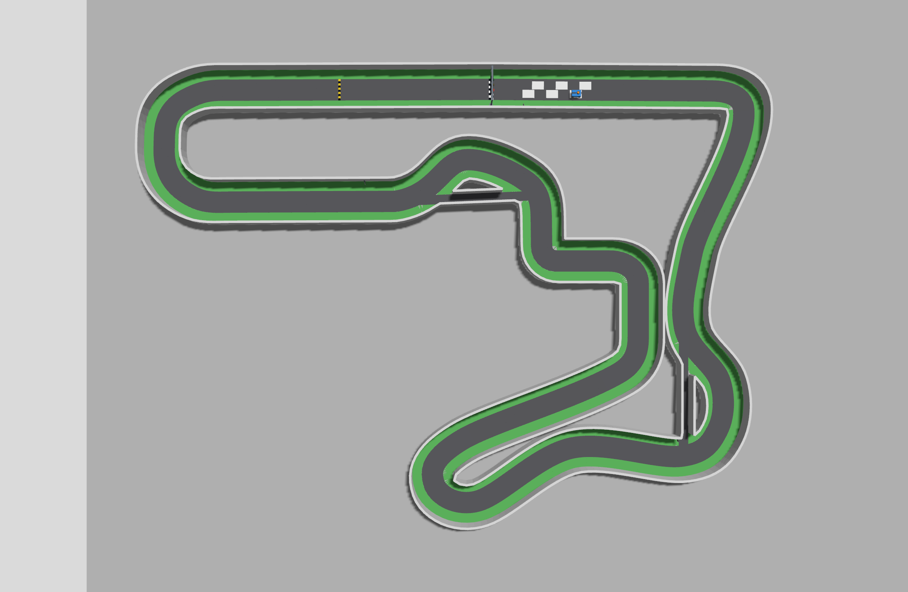
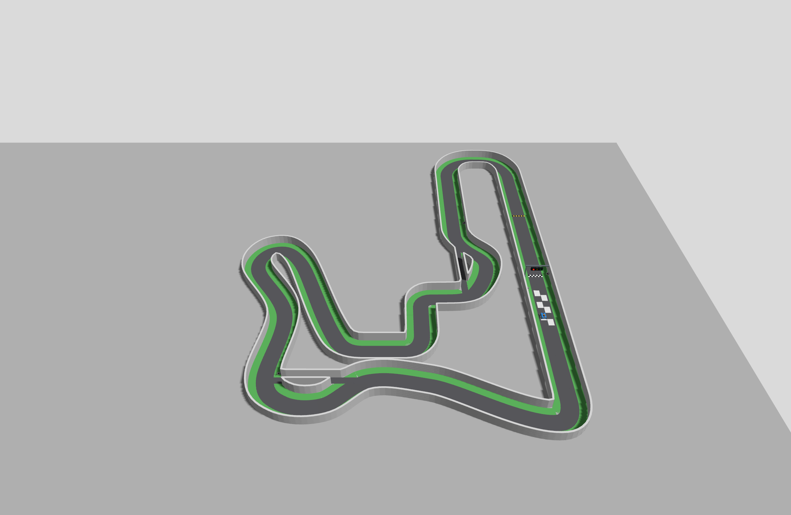

# 2026 IT ARENA 자율주행 경주

GIST-ISAAC-Robotics의 2026 IT ARENA 자율주행 대회 참가를 위한 소프트웨어·시뮬레이션 작업 공간입니다.

현재 인수인계는 [프로젝트 현황](docs/PROJECT_CONTEXT.md), 구동 모델은 [단일 모터·차동 차량 동역학](docs/simulation/VEHICLE_DYNAMICS.md), 센서 기준선은 [상부 LiDAR·하부 ToF 링](docs/sensors/TOF_RING.md), 이후 조향·회피·추월 후보는 [알고리즘 검토 노트](docs/autonomy/ALGORITHM_OPTIONS.md)에서 계속 관리합니다.

최근 작업: [LiDAR 갱신률·20 km/h 직접 실험과 실패 기록](artifacts/validation/2026-09-03/lidar_rate_sweep/README.md) · [운동 보상과 자기 위치 추정 설명](docs/sensors/LIDAR_MOTION_AND_RATE.md) · [센서 구성 재검토](docs/sensors/PERCEPTION_ARCHITECTURE_REVIEW.md). 독립 시험 결과이며 기본 주행 속도·센서 배치와 공식 트랙은 바꾸지 않았습니다.

주최 측에서 제공한 트랙 자료를 출발점으로 삼으며, 다음을 목표로 합니다.

- 팀이 확정한 전체 외형 20 cm x 15 cm를 사용하고, 축거·윤거 등 미확정 치수를 매개변수로 조정할 수 있는 Ackermann 조향 차량
- RealSense D435i와 호환되는 시뮬레이션 카메라·깊이·IMU 인터페이스
- Jetson과 ESP32의 구동 제어 역할 분리 및 매개변수로 조정 가능한 휠 엔코더 시뮬레이션
- BLDC 하나·기계식 차동장치·좌우 뒷바퀴 엔코더 두 개를 가정한 토크 기반 구동 및 이상/손실/점성 LSD 비교
- 상부 2D LiDAR와 하부 다중영역 ToF 링을 이용한 서로 다른 높이의 주변 차량 감지
- 카메라 영상만을 이용한 신호등·ArUco 마커 인식
- 단독 차량의 경로 추종을 먼저 구현한 뒤, 여러 차량이 함께 달릴 때의 안전 주행과 회피로 확장
- Gazebo에서만 얻을 수 있는 정답값과 실제 Jetson에서 실행할 자율주행 코드의 명확한 분리

## 현재 상태

- 현재 공식 트랙 근거는 [MOSW626/istech-it-arena](https://github.com/MOSW626/istech-it-arena)의 태그 [`v2026.09.02`](https://github.com/MOSW626/istech-it-arena/tree/v2026.09.02), 커밋 `cb8fc14b1027c956b04cc297fa1454a65c956bfb`입니다. 규정·일정·지원은 `MANUAL.md`, 트랙은 같은 버전의 `track/README.md`·출력물·도면·인쇄 시트를 함께 대조합니다.
- 공식 트랙 ZIP은 `assets/track/official/v2026.09.02/`에 수정하지 않고 보존했습니다. [출처·해시 기록](assets/track/official/v2026.09.02/SOURCE.md)과 [새 릴리스 재감사](docs/track/OFFICIAL_V2026_09_02_REAUDIT.md)에 근거를 남겼습니다. `v2026.09.01`·`v2026.08.31`, 초기 ZIP과 과거 활동·실패 기록도 그대로 보존합니다.
- 시뮬레이션 실행 환경으로 WSL2 Ubuntu 24.04를 선택했습니다.
- PC 시뮬레이션 소프트웨어로 ROS 2 Jazzy + Gazebo Harmonic을 선택했습니다.
- 전체 평면 외형은 길이 20 cm·폭 15 cm로 팀이 확정한 설계 목표입니다. 축거 14.5 cm, 윤거 13.5 cm, 바퀴 지름 5 cm·폭 1.2 cm와 센서 배치 등은 실측 전 임시값입니다.
- 현재 기본 모델은 20 cm x 15 cm 외형을 사용합니다. 초기 18 cm x 12 cm 모델의 검증 기록과 현재 모델의 기록은 활동 내역에서 구분합니다.
- 기본 실행은 공식 기반 `official`로, 본선 45 cm·지름길 각각 20 cm·한 바퀴 약 46.6329 m입니다. 공식 도로·중심선·합집합 벽을 사용하며 차량 20×15 cm는 축소하지 않습니다. 초기 35/12 cm `original`과 기존 45/25 cm `experimental`도 선택 실행할 수 있습니다.
- 코스 ArUco는 ID 0/20/30/45와 공식 인쇄판 10 cm·검은 코드 7 cm·흰 여백 각 1.5 cm·판 하단 5 cm를 적용했습니다. #12 운영 회의 결론 전 팀 실행본만 공식 벽 부착점에서 판 정면이 1.2 m 상류를 향하도록 기울입니다. 정지 RGB 12표본 중 11개를 검출했지만 고속·가림·실물 시험은 남았습니다.
- 차량 후면에는 흰 판 전체 5×5 cm의 `DICT_4X4_50` ID 10을 팀 시험용 시각 요소로 임시 구현했습니다. 코스 ID와 겹치지 않으며 ToF 위·LiDAR 스캔면 아래에 두었습니다. 공식 팀별 모양·ID·장착 기준이나 다른 차량에서의 검출 성능을 확정한 것은 아닙니다.
- 방지턱의 공식 명목 길이 5 cm·높이 1 cm는 반영하되, 곡선 단면과 색띠는 제작 STL 도착 전 임시입니다. 낮은 신호등·고정 데모 주기와 피니시 체크무늬도 임시입니다. `official`의 출발 그리드는 `v2026.09.02` 원본의 25×17 cm 흰색 채움 슬롯 6개를 그대로 보존합니다. [현재 공식 적용·미확정 구분](docs/decisions/0012-official-v2026-09-02-track.md)을 참고하십시오.
- 공식 벽의 `mu=mu2=0.8`은 보존했습니다. 도로·잔디·방지턱에는 공식 마찰계수가 없어 새 값을 주입하지 않았으며, 엔진 기본값과 별도 임시 타이어 모델은 실물 마찰 실측값이 아닙니다.
- `v2026.09.02`에서 [실제 짧은 실행 검사](artifacts/validation/2026-09-02/official_update/smoke_low_load_30.json)를 통과했습니다. RGB·깊이 848×480 약 30.30 sim Hz, ToF 여섯 개의 8×8 점군 약 15.15 sim Hz, 엔코더·IMU·직진·조향·명령 중단 정지·정상 종료를 확인했습니다. 벽시계 처리율 보장이 아닙니다.
- 같은 월드의 [0.16 m/s 방지턱 통과](artifacts/validation/2026-09-02/official_update/bump_only_retry2/report.json)는 1.1363 m 이동, 기준 높이 0.002998→최대 0.008058→최종 0.003000 m와 실제 정지·정상 종료를 확인했습니다. 고속·실물 서스펜션 시험이 아닙니다.
- `v2026.09.02`에서 [`brisk` 본선 한 바퀴+약 2 m](artifacts/validation/2026-09-02/official_update/brisk_one_lap.json)를 통과했습니다. 48.6927 m, 최고 지면 속도 0.789711 m/s, 최대 중심선 거리 0.128371 m, 정적 벽 겹침 0개, 조기 출발 없음, ID 0/20/30/45·좌우 벽 선택·실제 정지·정상 종료를 확인했습니다. 단일 저속 본선 결과이며 지름길·다중 차량·20 km/h 검증은 아닙니다.
- 완주·다각도 촬영 뒤 최종 소스에서 ROS 패키지 5개 빌드, Python/ROS 검사 117개, C++ 검사 1개·무작위 동력 관계 20,000회, 공식·실험 생성 해시와 공식·실험·초기 원본 재현 월드의 엄격한 SDF 검사를 통과했습니다. [전체 검증 근거](artifacts/validation/2026-09-02/official_update/README.md)에 중간 실패와 한계를 함께 보존했습니다.
- 수동 전진·조향 제어, 오도메트리(이동량 추정), D435i RGB·깊이·포인트 클라우드와 엔코더 토픽을 구현했습니다. 현재 총질량은 사용자 예상에 맞춘 2.000 kg의 임시 합산값이며 실제 BOM/CG 측정값은 아닙니다.
- 공식 전환 전 8/30 치수 변경 때 원본·실험 지도 각각의 짧은 전진·조향·RGB·깊이·IMU·엔코더·명령 중단 정지와 종료를 확인했습니다. 아래 8/31 완주·시설 영상 기록도 당시 `experimental` 기준이며 새 공식 트랙의 검증으로 승계하지 않습니다. 지름길 진입 궤적은 아직 검증하지 않았습니다.
- D435i 기본 설정은 RGB 848×480·60 FPS, 깊이 848×480·90 FPS입니다. RGB와 깊이의 명목 시야각·내부 파라미터·거리 경계를 분리했습니다. 실물 보정값·측정 오차는 미반영이며, 현재 PC에서 실시간 60/90 FPS 처리를 보장하지 않습니다.
- 원본·실험 지도의 최장 직선에 가까운 구간은 약 10.3 m입니다. 폐회로 중심선의 방위각 변화 폭 1° 조건으로 계산했으며, 가림 없는 센서 시야 거리를 뜻하지는 않습니다.
- 기존 `experimental`에 횡단 방향 신호등·곡선 방지턱·독립형 ArUco 표지판 4개·출발 표시 6개·체크무늬 피니시를 적용했습니다. 당시 실제 차량 RGB의 가시성 18조건과 저속 방지턱 통과를 확인했습니다. 해당 시설 치수와 검사 결과를 새 `official`의 벽 부착 마커·5 cm 방지턱에 전용하지 않습니다.
- 임시 RPLIDAR C1 기준 360°·10 Hz·500점·0.05~12 m 라이다와 동적 빨강→노랑→초록 신호, RGB 출발 판단·ArUco 분기 선택·라이다 벽 추종을 추가했습니다. 자율주행 노드는 정답 위치나 지도 파일을 읽지 않습니다.
- 하부 광학 중심 4 cm에 VL53L7CX급 다중영역 ToF 여섯 개를 임시 배치했습니다. 기본은 8×8·15 Hz이고 비교용 4×4·60 Hz도 선택할 수 있습니다. 벽 추종 조향은 RGB·라이다만 쓰고, 별도 ToF 보호층이 여섯 점군과 좌우 엔코더로 `/drive` 요청을 제한해 낮은 정적 표적 앞에서 감속·정지합니다. 방향 사이 사각과 실물 수량은 추가 검증 대상입니다.
- 공식 전환 전 `experimental`에서 속도 강제 구동 기준선은 본선 2바퀴+약 2 m를 완주했습니다. 후속 단일 모터 토크 구동+ToF 보호층 기준선은 `brisk`로 1바퀴+약 2 m(48.6527 m), 고정 외형-정적 벽 겹침 0회·실제 정지·정상 종료를 확인했습니다. 두 기록을 같은 차량 모델의 연속 검증이나 새 공식 월드의 완주로 합치지 않습니다.
- 별도 평지 시험은 약 20 km/h 도달/정지, 코너 5·8 km/h, 편측 저마찰 오픈/점성 LSD 비교, 전·후방 높이 5 cm 표적 정지를 완료했습니다. 요철·편측 턱·높은 CG에서 차체 들림·피치·롤·슬립은 나타났지만 시험 조건에서는 전복하지 않았습니다. 이는 물성 민감도 결과이지 실차 안전 속도나 전복 임계값이 아닙니다. [검증 요약](artifacts/validation/2026-08-31/vehicle_dynamics/README.md)
- 공식 전환 이전 소스에서 ROS 패키지 5개 빌드, Python/ROS 검사 98개와 C++ 차동 검사, 원본 무결성·실험 지도 재생성, 생성 차량·원본 재현/실험/동역학 실행 월드의 엄격한 SDF 검사를 통과했습니다. 이 수치는 과거 실행 기준이며 최신 검사는 [활동 기록](docs/activity/2026-08-31.md)의 해당 소스·산출물로 확인합니다. 주최 측 원본 SDF 자체의 알려진 잘못된 재질 스크립트는 보존하며 [트랙 감사](docs/track/TRACK_AUDIT.md)에 따라 파생 실행 월드만 사용합니다.
- 기존 정지 흔들림은 Gazebo의 jerk 제한에서 독립적으로 재현하여 해당 제한을 제외했으며 속도·가속도 제한은 유지했습니다. 차량 제동과 검사 프로그램 종료는 서로 다른 문제입니다.

현재 인수인계 내용은 [프로젝트 현황](docs/PROJECT_CONTEXT.md)을 참고하십시오. 새 릴리스 결과는 [`v2026.09.02` 재감사](docs/track/OFFICIAL_V2026_09_02_REAUDIT.md), 이전 공식판과 오류 근거·시설 해석은 [`v2026.09.01` 재감사](docs/track/OFFICIAL_V2026_09_01_REAUDIT.md)·[공식 파일 감사](docs/track/OFFICIAL_SOURCE_AUDIT.md)·[마커와 임시 시설](docs/track/OFFICIAL_MARKERS_AND_FACILITIES.md)에 보존합니다.

공식 [매뉴얼](https://github.com/MOSW626/istech-it-arena/blob/cb8fc14b1027c956b04cc297fa1454a65c956bfb/MANUAL.md)을 현재 규정 근거로 사용합니다. [2026-06-30 미팅](https://maddening-cause-ce7.notion.site/2026-06-30-38f99fd42e3080f6956fe5a5b90d0824)은 결정 경위 자료로 보존하며, 과거 접근 실패도 삭제하지 않습니다. 세 지도 선택과 기존 실험 재생성·차량 치수 근거는 [실험 트랙 안내](docs/track/EXPERIMENTAL_TRACK.md)에 정리했습니다.

센서 설정의 공식 출처, 60/60·30/30 프로필 선택, 깊이 거리·ROS 표현의 한계는 [D435i 설정 안내](docs/sensors/D435I_SIMULATION.md)를 참고하십시오. 상부 LiDAR와 여섯 하부 ToF의 배치·프로필·전원 및 실물 시험 조건은 [ToF 링 안내](docs/sensors/TOF_RING.md)에 있습니다.

## 초록불을 보고 계속 도는 데모

빌드와 ROS 환경 설정을 마친 WSL 터미널에서 실행합니다.

```bash
ros2 launch arena_bringup demo.launch.py
```

기본 지도는 `official`입니다. 데모는 빨강 8초·노랑 2초 후 초록으로 바뀌며, 카메라의 초록 인식 후 지름길을 피하고 본선을 반복 주행하도록 구성했습니다. 이 고정 순서는 무작위 시각 출발을 요구하는 공식 경기 절차의 완성 구현이 아닙니다. 한 바퀴 종료 조건은 없고 직선 최고 명령은 0.35 m/s이며 커브에서는 감속합니다. GUI 왼쪽 아래 일시정지 또는 실행 터미널의 `Ctrl+C`로 멈출 수 있습니다.

벽 추종기는 RGB 30 Hz와 라이다 10 Hz를 사용하고 깊이 센서는 끕니다. 독립 ToF 안전층은 여섯 점군과 좌우 엔코더로 속도를 제한·정지하며, 이동 차량 회피·추월은 아직 없습니다. 일반 `simulation.launch.py`의 RGB 60·깊이 90 기본값은 유지합니다. [실행·정지·신호등 제어 안내](docs/autonomy/BASIC_DEMO.md) · [ToF 감속·정지층](docs/autonomy/TOF_SAFETY.md)

공식 전환 전 `experimental` 확인 사진: [출발 구역과 빨간 신호](artifacts/screenshots/2026-08-31/basic_demo/start_grid_red.jpg) · [차량과 임시 라이다](artifacts/screenshots/2026-08-31/basic_demo/car_lidar_oblique.jpg) · [실제 차량 RGB의 초록 신호](artifacts/screenshots/2026-08-31/basic_demo/signal_green.png)

공식 전환 전 통합 실행의 [사선 조감도 한 바퀴 영상](artifacts/videos/2026-08-31/basic_autonomy_overhead_one_lap.mp4) · [검사 보고서](artifacts/screenshots/2026-08-31/basic_demo/final_integrated_report.json)

## 시설과 화면 기록

현재 `v2026.09.02` 기반 팀 실행 월드를 실제 Gazebo 고정 카메라로 촬영한 확인 사진입니다. 정수직과 네 방향 사선의 2300×1500 원본을 모두 직접 확인했으며 코스 전체와 두 지름길이 프레임 안에 들어옵니다. 팀 시험용 경사 마커·임시 신호등·곡선 방지턱·피니시가 포함됐습니다. 사진은 형상 확인 자료이고 주행·인지·실물 시공 검증은 별도입니다.





[서측](artifacts/screenshots/2026-09-02/official_update/track_west_oblique.png) · [동측](artifacts/screenshots/2026-09-02/official_update/track_east_oblique.png) · [북측](artifacts/screenshots/2026-09-02/official_update/track_north_oblique.png) · [다섯 사진의 시점·해시·재현 설명](artifacts/screenshots/2026-09-02/official_update/README.md)

이전 공식판 사진도 당시 기록으로 보존합니다: [`v2026.09.01` 출발 그리드와 차량](artifacts/screenshots/2026-09-01/official_grid_restore/start_grid_with_vehicle.png) · [복구 후 전체 사선 조감도](artifacts/screenshots/2026-09-01/official_grid_restore/track_overview_oblique.png) · [첫 `v2026.09.01` 전환 사진](artifacts/screenshots/2026-09-01/official_update/official_track_overview.png) · [이전 `v2026.08.31` 출발 구역](artifacts/screenshots/2026-08-31/official_update/official_start_area.png)

기존 `experimental`의 시설 치수·출발 번호·마커 가시성 검사와 당시 제어 문제는 [시설 안내](docs/track/FACILITIES.md)에 보존했습니다. 당시 실제 차량 RGB: [출발 신호](artifacts/screenshots/2026-08-31/facilities/signal_from_grid.png) · [표지판](artifacts/screenshots/2026-08-31/facilities/marker_30_75cm.png) · [곡선 방지턱](artifacts/screenshots/2026-08-31/facilities/bump_approach.png).

아래는 2026-08-31 **공식 전환 이전 시설 수정 후** 실제 Gazebo의 사선 항공뷰입니다. 본선 45 cm·지름길 25 cm의 과거 실험 지도이며, 차량은 20×15 cm의 임시 상자형 모델입니다.


[출발 그리드 6개·차량·피니시 근접 사진](artifacts/screenshots/2026-08-31/facilities/start_grid.jpg) · [시설 치수·검사 결과·관찰 구도](docs/track/FACILITIES.md)

시설 수정 전 사진도 삭제하지 않고 보존합니다: [이전 전체 조감도](artifacts/screenshots/2026-08-31/track_overview.jpg) · [차량 사선 사진](artifacts/screenshots/2026-08-31/car_oblique.jpg) · [차량 전면 사진](artifacts/screenshots/2026-08-31/car_front.jpg) · [초기 18×12 cm 모델 화면 기록](artifacts/screenshots/gazebo_baseline.png).

## 기본 실행 절차

```bash
sudo bash scripts/setup_wsl.sh # Ubuntu 24.04 안에서 최초 한 번만 실행
bash scripts/configure_wsl_user.sh
bash scripts/doctor.sh
colcon build --symlink-install
source install/setup.bash
ros2 launch arena_bringup simulation.launch.py
```

Gazebo 창 없이 실행하려면 `headless:=true`를 사용합니다. `/drive`에 `ackermann_msgs/AckermannDriveStamped` 형식의 명령을 발행하며, 시뮬레이션 엔코더 피드백은 `/wheel_states`와 `/wheel_encoder_ticks`에서 확인할 수 있습니다.

기본 실행은 `official`입니다. 다음처럼 세 지도를 명시적으로 선택할 수도 있습니다. 차량은 모두 20×15 cm이므로 초기 원본의 12 cm 지름길은 이용할 수 없습니다. 공식 지름길 20 cm도 정적 폭 여유와 연속 진입·합류 성공을 구분해야 합니다.

```bash
ros2 launch arena_bringup simulation.launch.py track:=official
ros2 launch arena_bringup simulation.launch.py track:=experimental
ros2 launch arena_bringup simulation.launch.py track:=original
```

위 명령은 하나씩 실행하고 `Ctrl+C`로 종료한 뒤 다른 지도를 선택합니다. 공식 실행 월드는 보존 ZIP과 [설정 파일](config/tracks/official_v2026.09.02.yaml)에서 다음과 같이 재생성합니다. `--check`는 원본·입력·출력 해시와 출처 기록을 대조하며 재생성이나 실제 주행을 대신하지 않습니다.

```bash
python3 scripts/build_official_track.py
python3 scripts/build_official_track.py --check
python3 -m pytest tests src/arena_vehicle_interface/test -q
```

영상 결합 실험에는 `d435i_profile:=synchronized_60`, 부하를 낮추려면 `d435i_profile:=low_load_30`을 추가합니다. 별도 터미널에서 대용량 영상을 수신할 때는 실행 환경과 동일하게 `export FASTDDS_BUILTIN_TRANSPORTS=LARGE_DATA`를 적용합니다. 이는 프로젝트의 전송 선택이며 실시간·무누락 보장은 아닙니다.

ToF의 기본 8×8·15 Hz를 4×4·60 Hz 비교용으로 바꾸려면 `tof_profile:=low_latency_4x4_60`을 추가합니다. 4×4 중심 광선이 낮은 표적을 놓치는 조건과 토픽 해석은 [ToF 링 안내](docs/sensors/TOF_RING.md)를 참고하십시오.

환경 설정을 불러온 별도의 WSL 터미널에서 다음 저속 주행 명령을 실행할 수 있습니다.

```bash
ros2 topic pub -r 20 /drive ackermann_msgs/msg/AckermannDriveStamped \
  "{drive: {steering_angle: 0.15, speed: 0.25}}"
```

명령 발행을 중단하려면 `Ctrl+C`를 누릅니다. 차량 측 명령 감시 기능(watchdog)은 새로운 명령이 0.5초 동안 들어오지 않으면 값이 0인 명령을 보냅니다.
