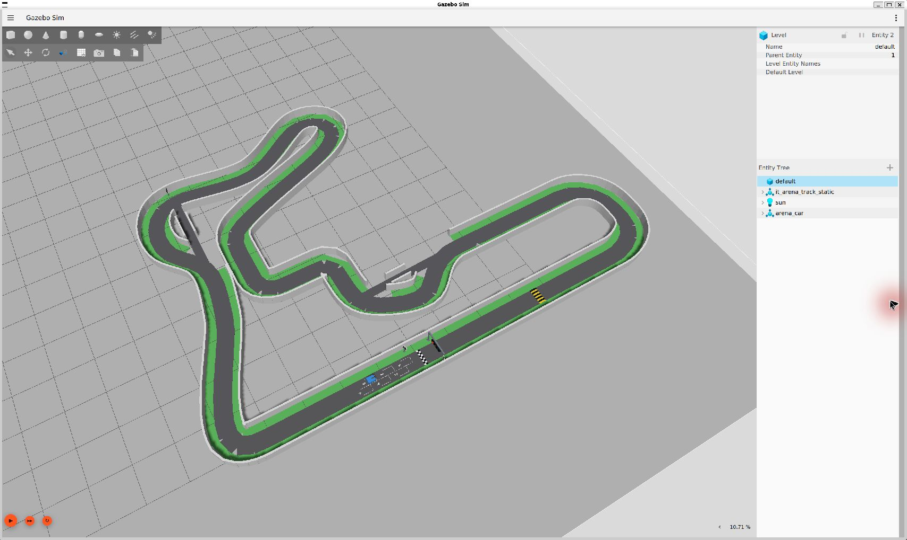

# 2026 IT ARENA 자율주행 경주

GIST-ISAAC-Robotics의 2026 IT ARENA 자율주행 대회 참가를 위한 소프트웨어·시뮬레이션 작업 공간입니다.

> **임시 읽을거리:** 저장소 생성부터 현재 구현, 차량 모델의 상세 수준, 센서 배치·대략 가격, 조향·회피·추월 선택지와 주최 측 질문은 [2026-08-31 임시 보고서](docs/reports/TEMP_REPORT_2026-08-31.md)에 정리했습니다. 한 번 읽고 팀 논의에 쓰기 위한 시점별 문서입니다.

주최 측에서 제공한 트랙 자료를 출발점으로 삼으며, 다음을 목표로 합니다.

- 팀이 확정한 전체 외형 20 cm x 15 cm를 사용하고, 축거·윤거 등 미확정 치수를 매개변수로 조정할 수 있는 Ackermann 조향 차량
- RealSense D435i와 호환되는 시뮬레이션 카메라·깊이·IMU 인터페이스
- Jetson과 ESP32의 구동 제어 역할 분리 및 매개변수로 조정 가능한 휠 엔코더 시뮬레이션
- 필요에 따라 낮은 위치에 장착한 2D LiDAR와 근거리 ToF 센서로 감지 범위 보완
- 카메라 영상만을 이용한 신호등·ArUco 마커 인식
- 단독 차량의 경로 추종을 먼저 구현한 뒤, 여러 차량이 함께 달릴 때의 안전 주행과 회피로 확장
- Gazebo에서만 얻을 수 있는 정답값과 실제 Jetson에서 실행할 자율주행 코드의 명확한 분리

## 현재 상태

- 원본 트랙 ZIP은 `assets/track/original/`에 보존했으며, SHA-256 해시를 기록했습니다.
- 압축을 푼 트랙 자료는 `assets/track/source/`에 있습니다.
- 시뮬레이션 실행 환경으로 WSL2 Ubuntu 24.04를 선택했습니다.
- PC 시뮬레이션 소프트웨어로 ROS 2 Jazzy + Gazebo Harmonic을 선택했습니다.
- 전체 평면 외형은 길이 20 cm·폭 15 cm로 팀이 확정한 설계 목표입니다. 축거 14.5 cm, 윤거 13.5 cm, 바퀴 지름 5 cm·폭 1.2 cm와 센서 배치 등은 실측 전 임시값입니다.
- 현재 기본 모델은 20 cm x 15 cm 외형을 사용합니다. 초기 18 cm x 12 cm 모델의 검증 기록과 현재 모델의 기록은 활동 내역에서 구분합니다.
- 원본 재현용 본선 35 cm·지름길 12 cm 지도는 보존했습니다. 기본 실행은 별도 실험 지도인 본선 45 cm·지름길 25 cm이며, 중심선과 경로 길이는 유지합니다. 어느 쪽도 최신 공식 코스라고 확정한 상태가 아닙니다.
- 수동 전진·조향 제어, 오도메트리(이동량 추정), D435i RGB·깊이·포인트 클라우드와 엔코더 토픽을 구현했습니다. 최종 검증 결과는 활동 기록에 남깁니다.
- 8/30 치수 변경 때 원본·실험 지도 각각의 짧은 전진·조향·RGB·깊이·IMU·엔코더·명령 중단 정지와 종료를 확인했습니다. 본선 단독 완주는 아래 8/31 최종 데모에서 별도로 검증했으며, 지름길 진입 궤적은 아직 검증하지 않았습니다.
- D435i 기본 설정은 RGB 848×480·60 FPS, 깊이 848×480·90 FPS입니다. RGB와 깊이의 명목 시야각·내부 파라미터·거리 경계를 분리했습니다. 실물 보정값·측정 오차는 미반영이며, 현재 PC에서 실시간 60/90 FPS 처리를 보장하지 않습니다.
- 원본·실험 지도의 최장 직선에 가까운 구간은 약 10.3 m입니다. 폐회로 중심선의 방위각 변화 폭 1° 조건으로 계산했으며, 가림 없는 센서 시야 거리를 뜻하지는 않습니다.
- 실험본에 횡단 방향 신호등·곡선 방지턱·독립형 ArUco 표지판 4개·출발 표시 6개·체크무늬 피니시를 적용했습니다. 실제 차량 RGB의 가시성 18조건과 저속 방지턱 통과를 확인했습니다. 시설 치수는 공식 사양이 아닙니다.
- 임시 RPLIDAR C1 기준 360°·10 Hz·500점·0.05~12 m 라이다와 동적 빨강→노랑→초록 신호, RGB 출발 판단·ArUco 분기 선택·라이다 벽 추종을 추가했습니다. 자율주행 노드는 정답 위치나 지도 파일을 읽지 않습니다.
- 종료 신호 보완 뒤 같은 실행에서 본선 두 바퀴와 추가 2 m, 총 95.2856 m의 연속 주행·기록 표본상 초록 전 움직임 없음·고정 20×15 cm 외형과 정적 벽 겹침 0회·지속 정지·정상 종료를 확인하여 최종 통합 검사가 통과했습니다. 이전 종료 실패 보고서는 별도 과거 근거로 보존합니다.
- 최종 소스에서 ROS 패키지 5개 빌드, 자동 검사 62개, 원본·실험 월드의 엄격한 SDF 검사를 통과했습니다. 이 결과는 단일 차량 저속 데모이며 조향 중 바퀴 전체·도로 경계·다중 차량 회피나 추월을 검증한 것이 아닙니다.
- 기존 정지 흔들림은 Gazebo의 jerk 제한에서 독립적으로 재현하여 해당 제한을 제외했으며 속도·가속도 제한은 유지했습니다. 차량 제동과 검사 프로그램 종료는 서로 다른 문제입니다.

현재 인수인계 내용은 [프로젝트 현황](docs/PROJECT_CONTEXT.md)을 참고하십시오. 주최 측 트랙 README를 근거로 사용하기 전에는 [트랙 감사 기록](docs/track/TRACK_AUDIT.md)을 먼저 읽어야 합니다.

계속 참고할 원문은 [2026-06-30 미팅](https://maddening-cause-ce7.notion.site/2026-06-30-38f99fd42e3080f6956fe5a5b90d0824)입니다. 당시 기준과 현재 파일을 구분하며, 지도 전환·재생성과 차량 치수 근거는 [실험 트랙 안내](docs/track/EXPERIMENTAL_TRACK.md)에 정리했습니다.

센서 설정의 공식 출처, 60/60·30/30 프로필 선택, 깊이 거리·ROS 표현의 한계는 [D435i 설정 안내](docs/sensors/D435I_SIMULATION.md)를 참고하십시오.

## 초록불을 보고 계속 도는 데모

빌드와 ROS 환경 설정을 마친 WSL 터미널에서 실행합니다.

```bash
ros2 launch arena_bringup demo.launch.py
```

빨강 8초·노랑 2초 후 초록으로 바뀌고, 차량 카메라가 이를 확인하면 지름길을 피하며 계속 본선을 돕니다. 한 바퀴 종료 조건은 없습니다. 직선 최고 명령은 0.35 m/s이며 커브에서는 감속합니다. GUI 왼쪽 아래 일시정지 또는 실행 터미널의 `Ctrl+C`로 멈출 수 있습니다.

데모는 RGB 30 Hz와 라이다 10 Hz를 사용하고 사용하지 않는 깊이 센서는 끕니다. 일반 `simulation.launch.py`의 RGB 60·깊이 90 기본값은 유지합니다. [실행·정지·신호등 제어 안내](docs/autonomy/BASIC_DEMO.md) · [C1 사양과 임시 장착 한계](docs/sensors/RPLIDAR_C1_SIMULATION.md)

중간 확인 사진: [출발 구역과 빨간 신호](artifacts/screenshots/2026-08-31/basic_demo/start_grid_red.jpg) · [차량과 임시 라이다](artifacts/screenshots/2026-08-31/basic_demo/car_lidar_oblique.jpg) · [실제 차량 RGB의 초록 신호](artifacts/screenshots/2026-08-31/basic_demo/signal_green.png)

최종 통합 실행의 [사선 조감도 한 바퀴 영상](artifacts/videos/2026-08-31/basic_autonomy_overhead_one_lap.mp4) · [검사 보고서](artifacts/screenshots/2026-08-31/basic_demo/final_integrated_report.json)

## 시설과 화면 기록

새 시설 치수·출발 번호·마커 가시성 검사와 남은 제어 문제는 [시설 안내](docs/track/FACILITIES.md)에 정리했습니다. 실제 차량 RGB: [출발 신호](artifacts/screenshots/2026-08-31/facilities/signal_from_grid.png) · [표지판](artifacts/screenshots/2026-08-31/facilities/marker_30_75cm.png) · [곡선 방지턱](artifacts/screenshots/2026-08-31/facilities/bump_approach.png).

아래는 2026-08-31 **시설 수정 후** 실제 Gazebo의 사선 항공뷰입니다. 본선 45 cm·지름길 25 cm의 실험 지도이며, 차량은 20×15 cm의 임시 상자형 모델입니다.



[출발 그리드 6개·차량·피니시 근접 사진](artifacts/screenshots/2026-08-31/facilities/start_grid.jpg) · [시설 치수·검사 결과·관찰 구도](docs/track/FACILITIES.md)

시설 수정 전 사진도 삭제하지 않고 보존합니다: [이전 전체 조감도](artifacts/screenshots/2026-08-31/track_overview.jpg) · [차량 사선 사진](artifacts/screenshots/2026-08-31/car_oblique.jpg) · [차량 전면 사진](artifacts/screenshots/2026-08-31/car_front.jpg) · [초기 18×12 cm 모델 화면 기록](artifacts/screenshots/gazebo_baseline.png).

## 기본 실행 절차

```bash
sudo bash scripts/setup_wsl.sh # Ubuntu 24.04 안에서 최초 한 번만 실행
bash scripts/configure_wsl_user.sh
bash scripts/doctor.sh
colcon build --symlink-install
source install/setup.bash
ros2 launch arena_bringup simulation.launch.py
```

Gazebo 창 없이 실행하려면 `headless:=true`를 사용합니다. `/drive`에 `ackermann_msgs/AckermannDriveStamped` 형식의 명령을 발행하며, 시뮬레이션 엔코더 피드백은 `/wheel_states`와 `/wheel_encoder_ticks`에서 확인할 수 있습니다.

기본 실행은 실험 지도입니다. 원본 재현용은 아래와 같이 선택합니다. 차량은 두 지도 모두 20×15 cm이므로 원본의 12 cm 지름길은 이용할 수 없습니다.

```bash
ros2 launch arena_bringup simulation.launch.py track:=original
```

영상 결합 실험에는 `d435i_profile:=synchronized_60`, 부하를 낮추려면 `d435i_profile:=low_load_30`을 추가합니다. 별도 터미널에서 대용량 영상을 수신할 때는 실행 환경과 동일하게 `export FASTDDS_BUILTIN_TRANSPORTS=LARGE_DATA`를 적용합니다. 이는 프로젝트의 전송 선택이며 실시간·무누락 보장은 아닙니다.

환경 설정을 불러온 별도의 WSL 터미널에서 다음 저속 주행 명령을 실행할 수 있습니다.

```bash
ros2 topic pub -r 20 /drive ackermann_msgs/msg/AckermannDriveStamped \
  "{drive: {steering_angle: 0.15, speed: 0.25}}"
```

명령 발행을 중단하려면 `Ctrl+C`를 누릅니다. 차량 측 명령 감시 기능(watchdog)은 새로운 명령이 0.5초 동안 들어오지 않으면 값이 0인 명령을 보냅니다.
