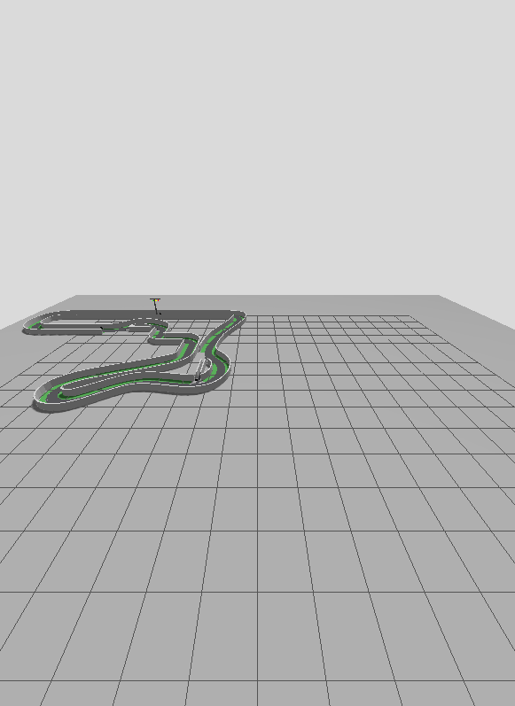

# 2026 IT ARENA Autonomous Racing

Software and simulation workspace for the GIST-ISAAC-Robotics entry in the 2026 IT ARENA autonomous-driving event.

The project starts from the organizer's supplied track package and targets:

- a parameterized Ackermann vehicle no larger than the 20 cm x 15 cm rule envelope;
- a RealSense D435i-compatible simulated camera/depth/IMU interface;
- a Jetson-to-ESP32 actuation boundary with configurable wheel-encoder simulation;
- optional low-mounted 2D LiDAR and short-range ToF coverage;
- camera-only traffic-light and ArUco recognition;
- single-car path following first, then multi-car safety and avoidance;
- a clean boundary between Gazebo-only truth and code that can run on the Jetson.

## Current status

- The original track ZIP is preserved under `assets/track/original/` with a recorded SHA-256.
- The extracted track is under `assets/track/source/`.
- WSL2 Ubuntu 24.04 is the selected simulation host.
- ROS 2 Jazzy + Gazebo Harmonic is the selected PC simulation stack.
- Vehicle dimensions and sensor poses are provisional pending the hardware team's measurements.
- Manual forward/steering control, odometry, D435i RGB/depth/point cloud, and encoder topics are implemented; final verification results are tracked in the activity log.

Read [docs/PROJECT_CONTEXT.md](docs/PROJECT_CONTEXT.md) for the current handoff state and [docs/track/TRACK_AUDIT.md](docs/track/TRACK_AUDIT.md) before trusting the track README.



## Intended quick start

```bash
sudo bash scripts/setup_wsl.sh # once inside Ubuntu 24.04
bash scripts/configure_wsl_user.sh
bash scripts/doctor.sh
colcon build --symlink-install
source install/setup.bash
ros2 launch arena_bringup simulation.launch.py
```

Use `headless:=true` when no Gazebo window is wanted. Publish an `ackermann_msgs/AckermannDriveStamped` command on `/drive`; simulated encoder feedback is available on `/wheel_states` and `/wheel_encoder_ticks`.

Example low-speed command from another sourced WSL terminal:

```bash
ros2 topic pub -r 20 /drive ackermann_msgs/msg/AckermannDriveStamped \
  "{drive: {steering_angle: 0.15, speed: 0.25}}"
```

Stop the publisher with `Ctrl+C`. The vehicle-side watchdog sends a zero command after 0.5 seconds without a fresh command.
