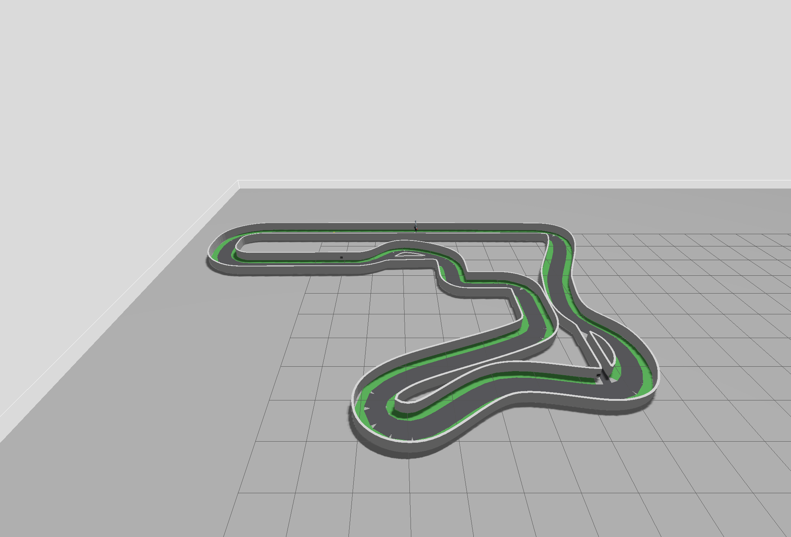

# 공식 `v2026.09.01` 트랙 확인 사진

- 촬영일: 2026-09-01
- 대상: `track:=official`, `v2026.09.01` 기반 파생 실행 월드와 20×15 cm 차량
- Gazebo Sim 8.11.0의 GUI 카메라 pose를 조정한 뒤 내장 스크린샷 기능으로 원본 렌더링을 저장했다.
- 사진은 본선·두 지름길·벽·잔디·출발 구역의 전체 배치 확인용이다. 화면의 그리드와 회색 행사장 바닥은 Gazebo 표시이며 실제 행사장 재질 사진이 아니다.
- 이 사진만으로 마커 가시성, 충돌 안전, 지름길 연속 진입, 실제 치수·마찰 또는 실물 제작 완료를 입증하지 않는다. 실행 검증은 [`artifacts/validation/2026-09-01/official_update/`](../../../validation/2026-09-01/official_update/README.md)에서 확인한다.
