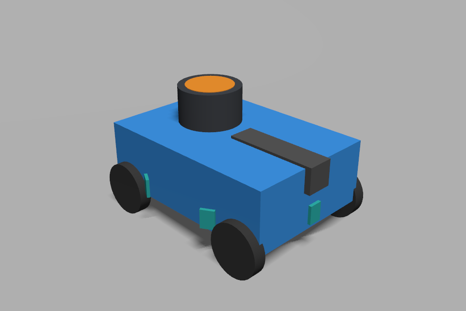

# 하부 다중영역 ToF 검증 자료

검증 날짜: 2026-08-31. 입력 파일 해시는 각 저상 표적 검사 JSON의 `input_sha256`에 있습니다.

## 최종 실행

| 항목 | 8×8·15 Hz 기본 프로필 | 4×4·60 Hz 비교 프로필 |
|---|---|---|
| 저상 표적 검사 | [결과 JSON](8x8/report.json) | [결과 JSON](4x4/report.json) |
| 높이 5 cm·폭 15 cm 표적, 거리 18 cm | 여섯 방향 검출 | 여섯 방향 검출 |
| 같은 표적, 거리 50 cm | 여섯 방향 검출 | **여섯 방향 모두 미검출** |
| ROS 점군·짧은 직진·조향·정지 | [통과 JSON](smoke_8x8.json) | [통과 JSON](smoke_4x4.json) |
| 관측 ToF 주기, 시뮬레이션 시간 기준 | 약 15.15 Hz | 약 62.50~62.56 Hz |
| 최종 검사 종료 | 정상 | 정상 |

4×4 표적 JSON의 `passed: true`는 18 cm 필수 검사와 기록·종료가 통과했다는 뜻입니다. **50 cm 검출에 성공했다는 뜻은 아닙니다.** 이 조건은 비교 관측으로 명시했으며 누락 결과를 보존했습니다.

두 주행 검사에서는 RGB와 깊이 모두 `low_load_30`을 사용했습니다. 이 실행의 실제 시간 대비 시뮬레이션 속도는 약 0.17~0.34배였으므로 실시간 15/60 Hz 처리나 새 구성의 RGB 60·깊이 90 Hz 처리량을 입증하지 않습니다. 명목 주기와 관측 주기의 작은 차이도 실제 센서의 최대 주파수 보장이 아닙니다.

전체 자동 검사 76개와 원본·실험 월드 및 두 차량 SDF의 엄격 검사가 통과했습니다. 기존 두 바퀴 완주 영상은 ToF 추가 전 기록이며 이번에는 완주·다중 차량 회피·ToF 기반 제동을 다시 구현하거나 시험하지 않았습니다.

## 차량 표시

실제 Gazebo 카메라 영상입니다. 위쪽 검정/주황 원통은 C1 대체 형상, 앞쪽 검정 막대는 D435i 대체 형상, 하부 청록색 부품은 ToF 캐리어입니다. 이 구도에서는 여섯 개 전부가 보이지 않습니다. 차체 충돌 외형은 20×15 cm를 유지했고, 센서가 보이도록 표시용 상자만 안쪽에 넣었습니다. 실제 기구 설계 검증 사진이 아닙니다.

## 보존한 종료 실패

[앞선 8×8 검사](8x8_shutdown_failure/report.json)는 두 거리의 표적 검출과 촬영에 성공했지만 Gazebo가 종료 제한시간을 넘겨 강제 종료되었습니다. 따라서 `passed: false`로 그대로 남겼습니다. ROS 노드들은 정상 종료했고 Gazebo 서버 종료가 지연된 것은 확인했지만 내부 원인까지 확정하지는 않았습니다.

검사 전용 카메라를 실행 중 먼저 제거하고 프레임 갱신을 확인한 뒤 서버를 종료하도록 보완했습니다. 부모의 대기 시간도 ROS 자체 종료 단계보다 길게 두었습니다. 이후 위 최종 두 실행은 정상 종료했습니다. 이것만으로 모든 Gazebo 종료 경로가 해결됐다고 단정하지 않습니다.

## 범위와 재현

표적은 여섯 센서의 정면에 놓은 정적 광학 상자입니다. 광선당 영역 중심 한 점을 검사하므로 실물의 영역 적분·부분 점유·외광·반사율·간섭·invalid 상태를 재현하지 않습니다. 인접 센서 사이 경계 사각과 움직이는 상대차는 검사하지 않았습니다.

[배치·명령·실물 시험 안내](../../../../docs/sensors/TOF_RING.md) · [활동 기록](../../../../docs/activity/2026-08-31.md)
