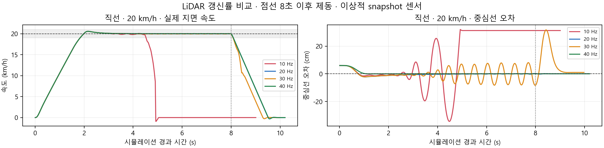

# 고정 속도 LiDAR 조향 시험

원본 JSON에서 자동 생성한 표입니다. 속도 도달, 추종·정지, 프로그램 종료를 분리합니다.

- 갱신률마다 500점, 동일 차량·100 Hz 조향기·물리 1 ms. 센서 입력은 `/scan`과 `/clock`입니다.
- 속도 유지: 목표 ±5%를 연속 2초 이상. 외형 판정: 회전한 20×17 cm 보수적 상자.
- 노면 폭 45 cm·벽 사이 85 cm. 원형 시험 반경 1 m는 공식 코스의 급커브보다 완만합니다.
- ToF 감속·RGB 출발·스캔 운동 보상·순차 회전 취득은 제외한 시험입니다. 실차 안전 인증이 아닙니다.

| 조건 | 설정 Hz | 실측 Hz | 최고 km/h | 속도 유지 s | 주행 RMSE cm¹ | 노면 이탈 표본² | 벽 겹침 표본² | 추종·정지 | 정상 종료 |
|---|---:|---:|---:|---:|---:|---:|---:|:---:|:---:|
| 직선 · 20 km/h | [10](straight_20kmh/010p00hz/report.json) | 10.04 | 20.56 | 2.67 | 27.18 | 253 | 202 | 실패 | 실패 |
| 직선 · 20 km/h | [20](straight_20kmh/020p00hz/report.json) | 20.06 | 20.56 | 6.15 | 0.26 | 0 | 0 | 통과 | 실패 |
| 직선 · 20 km/h | [30](straight_20kmh/030p00hz/report.json) | 30.38 | 20.56 | 6.15 | 4.82 | 25 | 3 | 실패 | 실패 |
| 직선 · 20 km/h | [40](straight_20kmh/040p00hz/report.json) | 40.01 | 20.56 | 6.15 | 0.01 | 0 | 0 | 통과 | 실패 |

정상 종료 열은 자식 프로세스 로그까지 다시 감사한 결과입니다. 초기 schema 1 보고서의 `shutdown_clean`은 부모만 확인했으므로 그대로 사용하지 않았습니다.
[부모·자식 종료 감사 원문](shutdown_audit.json)

¹ 출발 후 3초부터 주행 종료 전까지. 출발 오프셋 6 cm와 가속 구간의 영향을 줄인 지표입니다.
² 정지 과정까지 포함한 약 50 Hz 관측 표본 수입니다. 충돌 횟수·사고 횟수가 아니며, 서로 다른 표본 수를 사건 수로 비교하지 않습니다.

스캔 수집 시각과 제어 적용 시각의 관계, 제동 중 거동도 결과에 영향을 줍니다.
고정 속도 한 조건의 통과를 코스 완주·다중 차량·실물 성능이나 최소 구매 사양으로 확대하지 않습니다.
