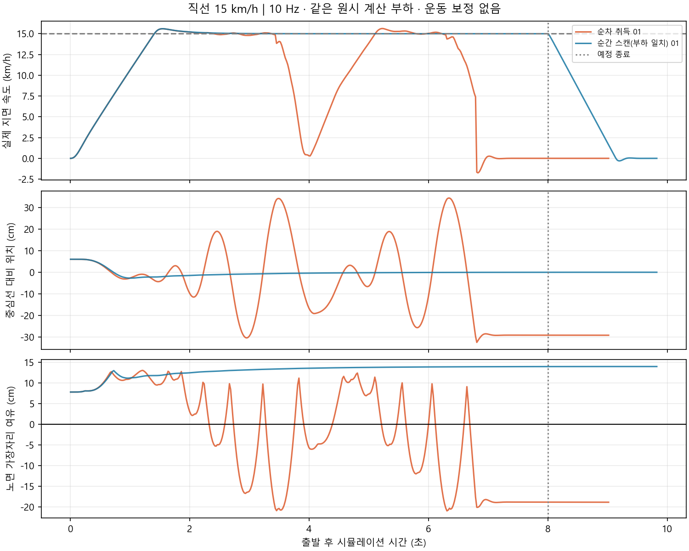

# 10 Hz 순간·순차 취득 비교 결과

각 행은 독립 실행 1회입니다. 통과는 목표 속도 ±5% 2초 이상 유지·8초 주행·정지까지 노면 이탈 없음·실제 정지·센서/제어 계측·정상 종료를 모두 요구합니다.

표는 원시 기록을 주행/제동 단계별로 재집계한 각 실행의 `phase_audit.json` 기준입니다. 최초 `report.json`은 덮어쓰지 않습니다. 기존 집계기는 8초 이전 조기 중단의 제동 구간을 주행 통계에 포함했습니다.

| 조건 | 취득 방식 | 통과 | 실제 최고 km/h | 목표 속도 유지 초 | 주행 중 노면 이탈 표본 | 정지 포함 이탈 표본 | 최대 중심 오차 cm | 센서 검증 | 정상 종료 |
|---|---|---|---:|---:|---:|---:|---:|---|---|
| [straight_15kmh](straight_15kmh_sequential_01/phase_audit.json) | sequential | 미통과 | 15.625 | 2.078 | 196 | 245 | 34.30 | True | True |
| [straight_15kmh](straight_15kmh_snapshot_matched_01/phase_audit.json) | snapshot_matched | 통과 | 15.600 | 6.639 | 0 | 0 | 6.00 | True | True |

이탈 표본 수는 이탈 사건 수나 확률이 아닙니다. 출발 오프셋 6 cm가 최대 오차에 포함됩니다. 최고속도 순간 도달과 목표 속도 안정 유지도 구분합니다.

## 실패 시계열과 센서 검증

- `straight_15kmh_sequential_01`: 첫 노면 이탈 2.345초; 최초 제어 예외 obstacle_stop 3.500초, wall_lost 6.800초; 원시 취득 시각 오차 최대 0.0018000000000029104초; 원시 공백 폐기 0회.
- `straight_15kmh_snapshot_matched_01`: 첫 노면 이탈 없음; 최초 제어 예외 없음; 원시 취득 시각 오차 최대 0.0018000000000029104초; 원시 공백 폐기 0회.

## 주행 기록 그래프

그래프는 저장된 물리 관측값입니다. 정답 위치는 평가에만 사용하고 조향 입력에는 사용하지 않았습니다.

### straight_15kmh

