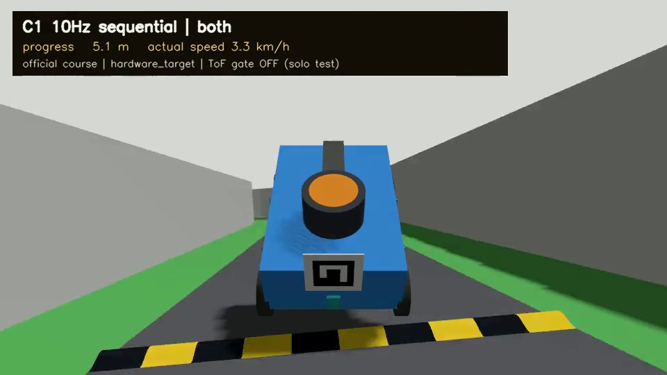

# 회전식 LiDAR 운동 보정 — 최종 시험 산출물

2026-09-08. 구현과 이번 시험은 종료했습니다. **독립 직선 20 km/h 결합 보정은 통과,
공식 코스 한 바퀴는 최고 12.38 km/h이며 최종 정지/프로세스 종료 검증은 미통과**입니다.

## 공식 코스 영상

- [3인칭 시뮬레이션 시간 1배속 영상](official_video_v1/lidar_third_person_simtime_1x.mp4)
- [원본 영상](official_video_v1/lidar_third_person_drive.mp4)
- [영상 시간 감사](official_video_v1/video_timing_audit.json), [주행 원문](official_video_v1/report.json)
- [속도·자세 재집계](official_video_v1/lap_analysis.json)

한 바퀴+약 2 m = 48.6727 m, 최고 실제 종방향 속도 12.3775 km/h입니다.
20 km/h는 상한 목표였으며 도달하지 않았습니다. 영상은 960×540·20 fps·60.5초,
1,210프레임이며 누락/유지 프레임 0입니다. 끝부분 신호등이 추적 카메라를 잠시 가립니다.
신호 인식 후 출발·코스 마커 네 ID·양쪽 벽 전환·평면 벽 겹침 표본 0을 확인했습니다.
단독 시험에서만 ToF 보호를 해제했고 일반 기본 보호는 유지했습니다.

### 미통과와 안전 한계

1. 방지턱에서 최대 피치 42.67°로 차체가 크게 들렸습니다. 아래는 영상 약 2.95초의 실제 프레임입니다.
   2D 운동 보정은 방지턱 자세 변화나 상대 차량 움직임을 해결하지 않습니다.
2. 로그에는 짧은 WALL_LOST 두 번이 있습니다. 발행된 보정 상태 294개가 정상이라는 사실과 구분합니다.
3. 목표 후 정지 확인은 실제 시간 60초 제한을 넘었습니다. DISABLED 후 sim시간 약 1.2초만 진행한
   정황은 검사 시간 부족을 시사하지만 최종 제동 trace가 없어 실제 정지를 확인하지 못했습니다.
4. 뒤이어 GPU Gazebo 종료가 멈춰 강제 종료(-9)됐습니다. 부모 launch가 0으로 끝나도 정상 종료가 아닙니다.
   따라서 `report.json`의 `passed:false`는 유지합니다. 영상에는 마지막 제동 구간이 없습니다.

## 독립 제어 시험

같은 차량·제어 이득·10 Hz·500점·순차 원시 500 Hz 부하에서 비교했습니다.
순간 대조군도 원시 부하를 맞췄습니다. 제어는 센서만 사용하며 정답 위치는 평가용입니다.

| 조건 | 결과 | 근거 |
|---|---|---|
| 직선 15 km/h, 5모드 | 순차 무보정만 이탈 | [표·그래프](boundary15_v1/RESULTS.md) |
| 직선 20 km/h, 5모드 | 결합만 주행·제동 통과; 이후만은 제동 이탈 | [표·그래프](boundary20_v1/RESULTS.md) |
| 반경 1 m 커브 8 km/h, 5모드 | 전부 통과 | [원문](circle8_v1/summary.json) |
| 결합 직선 5 km/h | 통과 | [원문](smoke_both_5/report.json) |
| 결합 직선 10/20·커브 5/10 km/h | 전부 통과; 직선 20은 총 2/2회 | [표·그래프](combined_regression_v1/RESULTS.md) |

독립 주행 20회는 취득·이동 입력·실제 정지·하위 21개 정상 종료를 모두 확인했습니다.
그중 이탈한 5회는 종합 미통과로 보존합니다. 적은 반복·이상화 IMU·임시 물성이므로
실물 최대속도나 모든 곡선/다중 차량 안전의 검증이 아닙니다.

## 보조 검증과 재현 근거

- [합성 정적 벽 28조건](geometry_v2/report.json): 시간/좌표 수학과 임의 교정 오차 민감도. 실물 시험 아님.
- [저장 센서 입력 재생](replay15_v1/report.json): 각 모드 800개 제어 시각. 새 폐루프 주행 아님.
- [공식 짧은 첫 실패](demo_short_v1/report.json), [ToF 보호 유지 재통과](demo_short_v2/report.json).
  느린 시뮬레이터의 실제 시간 감시만 선택적으로 3→30초로 조정했으며 측정 시각 기준은 유지했습니다.
- [최종 자동 검사 208개](unit_results_v6.xml), [실행 23개 소스 해시/종료 감사](run_integrity_audit.json).
- 각 실행의 commands, 원시 scan, 이동 입력, 평가 trace, launch 로그와 당시 입력 소스 ZIP은
  해당 폴더에 보존합니다. 초기 실패 XML·geometry_v1·무보정 실패도 덮어쓰지 않습니다.
- [구현·한계·재현 명령](../../../../docs/sensors/LIDAR_MOTION_IMPLEMENTATION.md),
  [설계 결정](../../../../docs/decisions/0018-sensor-based-lidar-motion-compensation.md).

GPU D3D12 NVIDIA RTX 5070 Laptop·GUI/깊이 카메라 해제를 사용했습니다. 물리 궤적이
바뀌었던 Bullet은 적용하지 않았습니다. 보정 계산 p95 약 0.6~0.7 ms와 전체 시뮬레이션
계산 시간을 구분하며, Jetson 실시간 성능으로 해석하지 않습니다.

다음은 카메라 기반 방지턱 인식/사전 감속 검토, 시뮬레이션 시간 기준 정지 검사와 제동
trace 보강, 실물 C1 시각·엔코더/자이로 교정입니다. GPU 종료는 별도 미해결 항목입니다.
