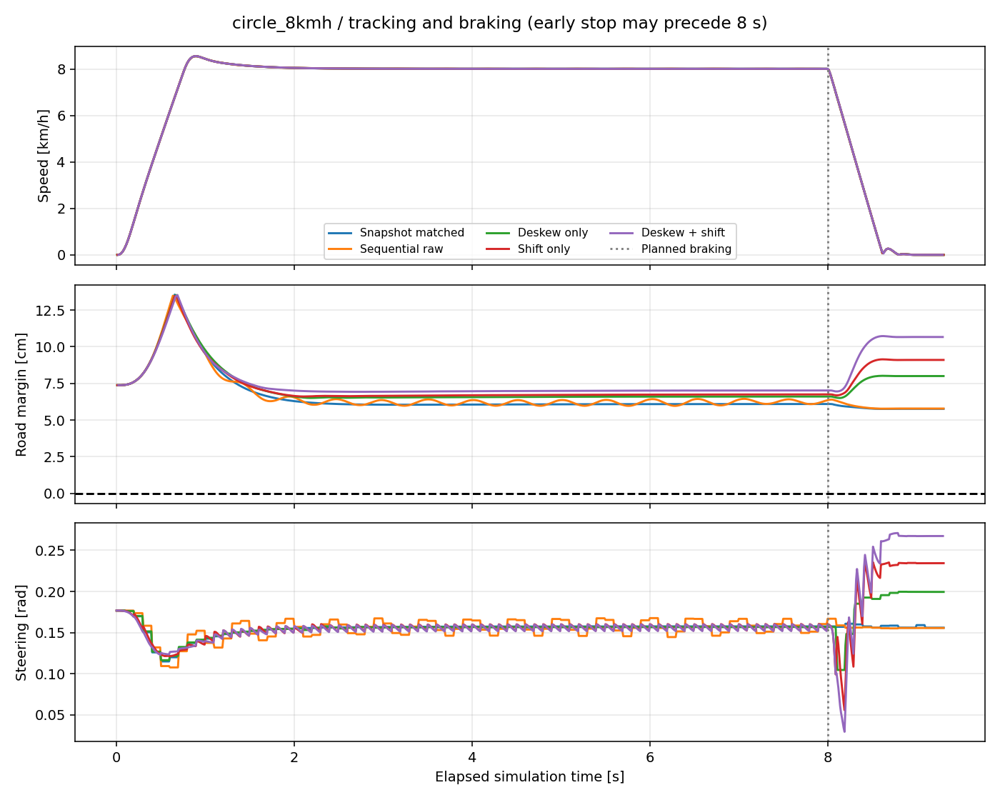

# 회전식 LiDAR 보정 비교

같은 제어기·차량·10 Hz·500점·500 Hz 원시 광선. 실물 검증·제품 최대속도 측정이 아닙니다.

| 조건 | 보정 | 주행·정지 | 센서/보정 | 종료 | 최고 km/h | 최대 중심선 오차 cm | 주행/제동 포함 노면 밖 표본 | 계산 p95 ms |
|---|---|---|---|---|---:|---:|---:|---:|
| circle_8kmh | snapshot | 통과 | 통과 | 통과 | 8.544 | 7.748 | 0 | 0.173 |
| circle_8kmh | none | 통과 | 통과 | 통과 | 8.537 | 7.840 | 0 | 0.172 |
| circle_8kmh | deskew | 통과 | 통과 | 통과 | 8.544 | 7.290 | 0 | 0.686 |
| circle_8kmh | shift | 통과 | 통과 | 통과 | 8.546 | 7.191 | 0 | 0.685 |
| circle_8kmh | both | 통과 | 통과 | 통과 | 8.547 | 6.869 | 0 | 0.759 |

그래프는 제동까지 포함합니다. 8초 세로선은 계획된 제동 시각이며 조기 중단은 더 빨리 발생할 수 있습니다.
노면 여유 0 미만은 평가 외형의 노면 이탈입니다. 실물 접촉 센서 판정이나 실제 차량 폭 변경이 아닙니다.
계산 시간은 이 PC·WSL의 벽시계 계측이며 Jetson 실시간 처리 보장이 아닙니다. 내부만은 오래된 기준 좌표를 의도적으로 사용하는 비교 모드입니다.
원문 report·입력·제어·평가 trace·소스 스냅샷을 각 실행 폴더에서 확인하십시오.
