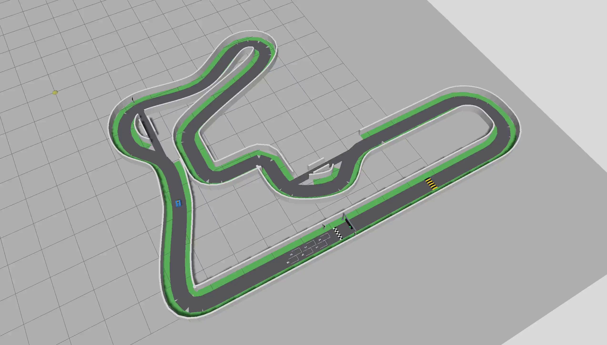

# 본선 한 바퀴 — 사선 조감도

[MP4 보기·다운로드](basic_autonomy_overhead_one_lap.mp4)

2026-08-31 최종 두 바퀴 통합 검사 중 Gazebo의 3D 사용자 카메라를 고정해 녹화했습니다. 데스크톱 화면이나 차량 1인칭 영상이 아닙니다. GitHub에서 재생 미리보기를 제공하지 않으면 MP4 페이지의 다운로드 버튼을 사용하십시오.

- 2548×1448 px, 약 25 FPS, 4,148프레임, 165.88초
- 26,264,832 bytes(약 25.05 MiB), 오디오 없음
- SHA-256: `BFA9B535DD3CB29E744C9616549309C8A8A9B211FC4F71347112C9D431280768`
- 시작·중간·끝 프레임 디코딩 및 실제 트랙 조감도 확인
- 시뮬레이션 시간 기준 녹화. 실제 PC 녹화 시간은 약 13분 20초이며 실시간 처리 성능을 뜻하지 않음

녹화 중 확인한 진행도는 약 39.35398 m(시뮬레이션 149.795 s)와 86.92677 m(314.379 s)입니다. 두 체크포인트 사이에만 약 47.57279 m를 진행했으므로 본선 한 바퀴 46.6329 m 이상을 포함합니다. 체크포인트는 녹화 시작·끝 프레임의 정확한 경계가 아닙니다.

이 실행 전체는 95.2856 m를 달린 뒤 지속 정지·정상 종료까지 통과했습니다. 단일 차량의 기초 데모이며 다중 차량 회피·추월이나 실차 안전성의 검증 영상은 아닙니다.

[최종 검사 JSON](../../screenshots/2026-08-31/basic_demo/final_integrated_report.json) · [조향·회피·추월 검토](../../../docs/autonomy/ALGORITHM_OPTIONS.md) · [데모 실행 방법](../../../docs/autonomy/BASIC_DEMO.md)
