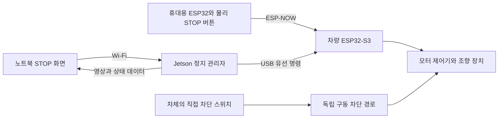

# 원격 비상정지와 노트북 모니터링 검토

확인일: 2026-09-18. 상태: **설계 제안·공식 문구 확인**, 구현·실물 안전 검증·구매 결정 아님.

공식 저장소 main `4c8d3d34671dd5066ce96193365977aa4d1a7662`의 MANUAL, 9/14 회의록, PDB 설명과 이슈 목록을 조회했다. 비상정지·자율주행 관련 #6은 댓글 0개이며 본문은 같은 결론이다. 이번 조회는 트랙 전체 재감사나 실행 기준 변경이 아니다. 사용자 전달의 모터 변경 가능성은 미확정이므로 특정 BLDC/ESC 결선을 확정하지 않는다.

## 1. 정확한 규정과 해석의 경계

[MANUAL §5–7](https://github.com/MOSW626/istech-it-arena/blob/4c8d3d34671dd5066ce96193365977aa4d1a7662/MANUAL.md):

- **원격** 비상정지의 HW·SW 스위치를 각각 최소 하나 준비하고, 경기 전 MeKENic 앞에서 시연한다.
- 고의 미비/미작동은 3단계, 즉 베스트 랩타임의 30% 가산이다. 비고의는 즉시 수정하며, 수정 곤란 시 Jetson 셧다운이 최후 대안이다.
- 제어 연산은 차량 안에서 수행하고, 사람의 조작은 정지·시작 리셋 범위로 제한한다. 원격 조종 등 위반은 실격이다.
- 출발은 차량의 신호등 시각 인식으로 결정한다. 10초 이상 정지 차량의 사람 개입·재시작 절차는 별도로 존재한다.

[9/14 회의 R2-2·R3-H](https://github.com/MOSW626/istech-it-arena/blob/4c8d3d34671dd5066ce96193365977aa4d1a7662/meetings/2026-09-14%20%EB%AF%B8%ED%8C%85.md)와 [#6](https://github.com/MOSW626/istech-it-arena/issues/6)도 같은 최소 요구를 제시한다. 무선 채널 배정은 10월 초 2차 회의로 이월됐고 마지노선은 10월 말이다.

**공개 문서가 정의하지 않은 것:** HW 스위치가 물리 입력 버튼을 뜻하는지, 독립 수신기·전원 차단 회로까지 필요한지, 두 경로의 독립성 수준, 허용 응답 시간·정지 거리, 모니터링 스트림의 상세 허용 범위. 휴대용 ESP32 버튼을 공식 적합 판정이 끝난 장치로 표현하지 않는다. 차체에만 달린 버튼으로 원격 요건을 충족한다고 가정하지 않는다.

**본 검토의 해석:** 영상·수치의 관찰/기록만 하고 주행 판단과 제어를 차량 안에 두면 규정 취지와 부합한다. 경기 중 목표속도·조향·경로·게인 변경, 노트북의 인식/계획 결과를 차량 제어에 돌려주는 것은 제한한다. 읽기 전용 텔레메트리의 명시적 허용 답변을 확보한 것은 아니다. 10초 규칙을 비상정지 명령을 10초 늦추는 타이머로 구현하지 않는다. 정지 요청은 즉시 처리하고 사람 접근·복귀 절차는 심판의 운영 해석을 따른다.

## 2. 우선 제안: ESP32 두 대와 노트북 Wi-Fi

기존 [ADR 0002](../decisions/0002-jetson-esp32-actuation-boundary.md)의 Jetson 판단·MCU 구동 분담을 유지한다.

- **휴대용 물리 STOP:** 노트북 없이 켜지는 별도 전원, 잠금식 버튼과 상태 표시. 버튼 조작은 Jetson을 거치지 않고 차량 MCU로 전달한다. 휴대용 ESP32가 버튼 해제만으로 재출발 명령을 내리지 않게 한다.
- **소프트웨어 STOP:** 노트북 웹 화면의 버튼 → Jetson의 전용 정지 요청 → USB → 차량 MCU 정지 상태 고정. 전체 ROS 네트워크를 노트북에 열 필요는 없다.
- **차량 MCU:** 정상 구동 명령과 비상정지를 최종 중재한다. 정지 중에는 새 양의 속도 명령도 거절한다. 정지 상태와 실제 출력 상태를 Jetson 및 휴대 장치에 보고한다.
- **차체 직접 차단:** MCU의 입력 GPIO를 읽는 버튼과 구별한다. 제어 코드가 실행되지 않아도 구동을 금지하는 전기적 경로를 별도로 검토한다. 이것은 원격 버튼을 대체하지 않는 추가 방어다.

이 구성은 **Jetson 정지에도 휴대용 정지가 살아 있는 구조**다. 두 원격 입력 모두 차량 MCU를 사용하므로 **차량 MCU 고장까지 독립인 이중 회로는 아니다.** 노트북 STOP을 USB로 휴대용 ESP32에도 전달하는 확장은 가능하지만, 동일 수신 MCU의 고장 경계가 사라지지는 않는다.

### 차량 MCU 고장에도 원격 차단하려면

차량에 별도 수신 ESP32를 추가해 총 3대로 구성한다. 휴대용 버튼 → 전용 수신기 → 주행 MCU를 거치지 않는 구동 허용/차단 회로로 연결한다. 주행 MCU와 수신기의 상태 감시, 전원·배선·출력의 공통 고장도 검토해야 한다. 같은 무선 환경에 노출되므로 보드 분리만으로 모든 고장에 독립인 것은 아니다.

외부 하드웨어 watchdog으로 주행 MCU의 실행 중단 때 구동 허용을 해제하는 보완도 가능하다. 단순 GPIO의 고정 HIGH를 생존 신호로 쓰지 말고, 정상 제어 주기와 연계된 변화를 감시해야 한다. ESP-IDF 내부 watchdog은 재부팅 수단이며, ESC 출력 차단 회로를 대신하지 않는다. [Espressif watchdog 설명](https://docs.espressif.com/projects/esp-idf/en/stable/esp32s3/api-reference/system/wdts.html).

## 3. 정지 명령을 받은 뒤의 동작

**프로그램 종료·목표속도 0·구동 전원 차단·차체 실제 정지는 서로 다르다.**

1. STOP 수신 또는 제어 입력 만료 즉시 비상정지 상태를 고정한다. 정상 제어 출력보다 우선한다.
2. 모터 제어기가 지원하고 실물 검증한 제동을 실행한다. 스로틀 중립, PWM 무신호, 모터 전원 차단이 능동 제동과 같다고 가정하지 않는다. 반대 방향 스로틀을 임의의 비상 브레이크로 사용하지 않는다.
3. 직접 차단 경로는 제어기 오작동에도 구동 에너지를 제한하도록 설계한다. 전원을 끊으면 오히려 관성으로 굴러갈 수 있으며, 회생전류·차단 소자의 DC 정격·돌입전류·서보 전원 유지 여부는 선정 제어기와 함께 검토한다.
4. 버튼 복귀나 통신 회복 후에도 정지 상태를 유지한다. 명시적 리셋 → 상태 점검 → 구동 허용 → 출발 대기 절차를 거친다. 최초 출발은 여전히 차량의 신호등 인식이 결정한다.
5. 부팅·재부팅·USB 재연결 때도 기본은 구동 금지다. 부팅 GPIO 상태나 ESC의 마지막 명령 유지로 차가 움직이지 않아야 한다. 조향을 갑자기 중앙으로 꺾는 동작도 자동 정답으로 두지 않는다.

정지 확인 화면은 `요청 전송 / 차량 정지 상태 고정 / 엔코더 저속 확인`을 구별한다. 바퀴 잠김·슬립 때문에 엔코더 0만으로 차체 정지를 확정할 수 없으며 실제 정지 거리는 외부 관찰과 함께 시험한다.

공식 PDB 설명은 J01(연산·MCU)과 M01(모터·서보)을 구분한다. 이를 이용해 **Jetson/감시 전원을 살리고 구동 쪽만 제한하는 구조**를 검토할 수 있다. 공개 설명에서 비상정지용 EN 단자의 존재·동작을 확인한 것은 아니므로 임의 핀에 연결하지 않는다. M01 전체 차단 시 서보도 꺼지는지 검토하고, 저전압 서보를 배터리 직결로 우회하지 않는다. [고정 PDB 설명](https://github.com/MOSW626/istech-it-arena/blob/4c8d3d34671dd5066ce96193365977aa4d1a7662/docs/hardware/power-modules.md). 이번 작업은 PDF 원본·실물 핀아웃 감사가 아니다.

## 4. 통신 선택

| 구간/기술 | 검토 결과 | 조건 |
|---|---|---|
| 휴대 ESP32 ↔ 차량 ESP32: ESP-NOW | 첫 시제품의 우선안. AP·IP 연결 없이 작은 정지·상태 패킷 교환 | 2.4 GHz 간섭, 양쪽 채널 일치, 응답 확인·재전송·시간 만료 처리는 직접 구현 |
| 휴대/노트북 ↔ ESP32: Bluetooth LE | 정지 명령에는 가능하지만 이번 우선안은 아님 | 연결/재연결·OS 절전·끊김 검증. S3는 Classic Bluetooth/SPP 미지원 |
| 노트북 ↔ Jetson: Wi-Fi | 영상·그래프·SW STOP에 적합 | 정지 버튼만 이 경로에 의존하면 Jetson/AP 장애에 취약 |
| Jetson ↔ 차량 MCU: USB 직렬 | 초기 구현 우선안 | 짧고 고정된 케이블, 전원 역급전 방지, 프레임·순번·만료 검사 |
| Jetson ↔ 차량 MCU: CAN/TWAI | EMI·배선 요구가 커질 때 대안 | 양쪽 실제 인터페이스, 외부 트랜시버·종단 필요. 연결만으로 제어 안전이 자동 보장되지는 않음 |

근거: [ESP-NOW 공식 API](https://docs.espressif.com/projects/esp-idf/en/stable/esp32s3/api-reference/network/esp_now.html), [S3 Bluetooth 기능](https://docs.espressif.com/projects/esp-idf/en/v5.2/esp32s3/api-guides/bluetooth.html), [S3 TWAI](https://docs.espressif.com/projects/esp-idf/en/stable/esp32s3/api-reference/peripherals/twai.html).

일반 노트북 Wi-Fi를 ESP-NOW 송신기로 바로 쓰는 구성을 전제로 하지 않는다. 노트북에서 ESP-NOW 경로를 사용하려면 USB에 연결한 ESP32를 송신 어댑터로 두는 것이 현실적이다. 휴대 장치의 물리 버튼은 USB/노트북 연결 없이도 작동해야 한다.

### ESP-NOW 구현 요구

- 정지 패킷은 짧게 하고, 페어링한 상대에게 암호화 유니캐스트로 보낸다. 장치 식별자·부팅 세션·증가 순번을 확인한다. 인증되지 않은 구동 허용이나 과거 패킷의 재사용을 막는다.
- 송신 성공 콜백은 MAC 계층 성공이다. **차량 애플리케이션이 정지를 적용했다는 응답**을 따로 받는다. 그 응답도 실제 차체 정지의 증명과는 다르다.
- 버튼을 누르면 즉시 보내고, 응답 누락 시 반복한다. 같은 STOP은 여러 번 와도 안전하게 처리한다. 수신 콜백에서는 긴 작업을 하지 않고 짧게 상태를 전달해 제어 작업에서 즉시 반영한다.
- 정상 상태에는 휴대 장치의 주기적인 생존 신호를 보내며, 수신이 일정 시간 끊기면 차량이 스스로 정지한다. 송신기 배터리 방전도 같은 고장 경로로 시험한다.
- 차량 MCU의 유선 제어 명령 만료와 무선 생존 신호 만료는 각각 검사한다. 통신 bridge가 오래된 목표값을 계속 재전송한다고 정상 제어로 간주하지 않는다.

위 수신 보장·콜백·암호화 조건은 [Espressif 문서](https://docs.espressif.com/projects/esp-idf/en/stable/esp32s3/api-reference/network/esp_now.html)에 근거한다. 상태 고정·패킷 필드·실물 시험 방법은 본 프로젝트 제안이다.

**시험 시작값 예시:** 유선 목표와 무선 생존 신호 50 Hz, 만료 100–200 ms를 저속 시험에서 검토한다. 이는 규정값도 검증된 안전값도 아니다. 20 km/h에서는 100 ms에 약 0.56 m, 200 ms에 약 1.11 m를 이동하고 그 뒤 제동거리까지 추가된다. 현재 시뮬레이션의 구동기 0.5초 timeout을 그대로 실차에 옮기지 않는다. 허용 거리에서 역산하고 부하·혼잡 상황의 지연과 오정지를 측정해 정한다.

ESP32-S3의 Wi-Fi와 BLE는 하나의 2.4 GHz 무선부를 공유한다. 같은 칩에서 ESP-NOW와 AP 접속을 함께 쓰면 AP와 채널을 맞춰야 한다. 따라서 차량 S3는 정지 통신에 집중하고 Jetson의 별도 Wi-Fi 장치가 영상을 담당하게 한다. [RF 공존](https://docs.espressif.com/projects/esp-idf/en/stable/esp32s3/api-guides/coexist.html), [ESP-NOW FAQ](https://docs.espressif.com/projects/esp-faq/en/latest/application-solution/esp-now.html).

## 5. 노트북 연결과 화면

가능하면 **Jetson → 5 GHz AP → 노트북**으로 연결한다. 노트북을 AP에 유선 연결하면 한쪽 무선 구간을 줄일 수 있다. 인터넷·클라우드는 필요 없다. 실제 Jetson 무선 어댑터의 5 GHz 지원과 드라이버를 먼저 확인하고, 채널/대역 사용은 주최 측 배정에 맞춘다. 5 GHz가 불가능하면 2.4 GHz에서 영상량을 낮추고 ESP-NOW와 동시에 시험한다. 5 GHz 분리도 무간섭 보장은 아니다.

Jetson의 작은 telemetry bridge가 이미 계산한 최신 값을 골라 전송하고, 웹 브라우저가 그래프와 표시를 담당한다. 수치에는 WebSocket을, 영상에는 별도 MJPEG 또는 H.264 경로를 우선 비교한다. SW STOP 요청도 영상 대기열과 분리한다. 경기 모드는 허용 명령을 STOP·허용된 리셋으로 제한하고 인증 및 고정 대상 연결을 사용한다. 임의 ROS 발행·파라미터 수정 통로를 열지 않는다.

| 화면 내용 | 최초 전송 설정 제안 | 의미/주의 |
|---|---|---|
| 목표속도·안전 제한 후 속도·MCU 적용 속도 | 10–20 Hz | `/drive`와 `/drive/safe`, 최종 출력의 차이를 표시 |
| 좌우 엔코더 속도·평균 바퀴 기반 속도 | 10–20 Hz | 실측 바퀴 반지름·기어비 필요. 지면 속도와 구별 |
| 목표 조향각·측정 조향각 | 10–20 Hz | 서보 위치/각도 피드백이 있을 때만 측정값 표시. 링크 변환과 영점 보정 필요 |
| 비상정지·구동 허용·정지 이유·통신 나이 | 10–20 Hz + 상태 변화 즉시 | 끊기면 마지막 숫자를 정상값처럼 남기지 않고 오래됨/수신 없음 표시 |
| 카메라 영상 | 640×360 또는 640×480, 5–10 fps부터 | 관찰용 사본의 설정. 차량 인식 입력 해상도·주기를 임의로 낮추지 않음 |
| 배터리·CPU/GPU·메모리·온도·제어 주기 | 1–2 Hz | 전압은 실제 계측 입력이 있을 때만 표시 |

숫자 0.5 kB짜리 상태 패킷을 20 Hz로 보내면 payload 약 10 kB/s다. 반면 RGB 원시 1280×720×3바이트×30 fps는 **약 83 MB/s, 664 Mbps**이며 네트워크 부가량도 별도다. 수치 전송과 원시 영상 전송을 같은 부하로 보면 안 된다.

실제 센서 수집·제어 주기는 유지하면서 화면용 전송만 낮춘다. 큐에는 최신 한두 표본만 유지하고 느린 수신자 때문에 차량 제어가 기다리지 않도록 한다. 카메라는 한 번만 열고 프레임을 분기한다. 마커·경로 같은 계산 결과 좌표를 보내 노트북에서 겹쳐 그리면 Jetson의 화면 합성 작업을 줄일 수 있다. 노트북은 이를 주행 제어로 되돌리지 않는다.

전체 데스크톱 원격 공유, 전체 ROS 토픽 자동 중계, 원시 깊이·점군의 상시 전송은 첫 구성에서 제외한다. ROS 내부 센서 구독도 최신 데이터 중심의 작은 큐로 정하고 신뢰성/QoS는 데이터 성격에 맞춘다. [ROS 2 Jazzy QoS](https://docs.ros.org/en/jazzy/Concepts/Intermediate/About-Quality-of-Service-Settings.html).

## 6. Jetson 성능에 미치는 영향

**연결 자체보다 영상 압축·복사·직렬화·네트워크 대기 방식이 중요하다.** 숫자만 보내는 구성은 비교적 가벼울 것으로 예상하지만, 실제 CPU 사용률이나 제어 영향은 아직 측정하지 않았다.

지원 기종인 **Jetson Orin Nano에는 NVENC가 없다.** CUDA GPU가 있다는 이유로 H.264 하드웨어 인코딩을 사용할 수 있다고 가정하지 않는다. NVIDIA는 해당 기종에 libx264 소프트웨어 인코딩 경로를 안내한다. [NVIDIA Software Encode in Orin Nano](https://docs.nvidia.com/jetson/archives/r36.4.4/DeveloperGuide/SD/Multimedia/SoftwareEncodeInOrinNano.html).

영상은 다음 순서로 비교한다.

1. 선정 카메라가 현재 사용 모드에서 MJPEG/H.264를 출력하면 압축 스트림 분기를 우선 검토한다. 실제 장치 모드·드라이버 확인이 필요하며 모든 USB 카메라가 이를 제공하는 것은 아니다.
2. 원시 영상만 있으면 작은 JPEG 미리보기를 낮은 fps로 생성해 비용을 측정한다. MJPEG도 CPU 비용과 대역폭을 쓴다.
3. 전송량이 문제면 저해상도 H.264 소프트웨어 인코딩을 비교한다. `ultrafast`/낮은 지연 설정·스레드 제한은 후보일 뿐 성능 보장이 아니다.
4. 과부하 시 영상 fps·해상도를 먼저 낮추거나 끈다. STOP 처리와 차량 제어 주기를 희생하지 않는다.

같은 전력 모드·주행 부하에서 `모니터링 OFF → 숫자만 → 숫자+영상 → 혼잡/연결 끊김`을 비교한다. [tegrastats](https://docs.nvidia.com/jetson/archives/r36.4.4/DeveloperGuide/AT/JetsonLinuxDevelopmentTools/TegrastatsUtility.html)로 CPU/GPU·메모리·열을 기록하고, 별도로 인식 지연·제어 주기 최대값/p99·명령 나이·누락 수를 기록한다. 낮은 평균 CPU만으로 영향 없음이라고 판정하지 않는다.

**모니터링 Wi-Fi만 끊긴 경우**에는 독립 원격 STOP 링크와 차량 자체 제어가 정상이라면 주행을 계속하도록 설계할 수 있다. **원격 STOP 생존 신호, Jetson 제어 명령 또는 필수 센서가 만료된 경우**는 정지 대상으로 구별한다. 노트북 창이 닫힌 것과 정지 장치를 잃은 것을 같은 사건으로 취급하지 않는다.

## 7. 현재 구현과 다음 확인

현재 코드에는 [ToF 정지층](../autonomy/TOF_SAFETY.md)과 시뮬레이션 명령 timeout이 있다. 이는 실차 원격 비상정지가 구현됐다는 뜻이 아니다. 실물 어댑터는 `/drive → 기존 안전층 → /drive/safe → 비상정지 중재 → 유선 MCU` 경로로 확장하되 비상정지는 MCU에서도 최종 강제한다. 일반 입력이 `/drive/safe`를 직접 발행하도록 열지 않는다.

먼저 확인할 항목은 최종 모터 제어기·제동/무신호/EN 동작, 조향 전원 유지 정책, 실제 PDB·커넥터와 차단 소자 정격, ESP32 보드 핀/전원, Jetson Wi-Fi 어댑터, 카메라 압축 출력 모드다. 이 정보 없이 회로·제동 방법을 확정하지 않는다.

저속 실물 검증에는 다음을 포함한다.

- 두 원격 버튼 각각 작동, 다른 입력에서 계속 주행 명령이 들어와도 정지 유지.
- Jetson 프로세스 종료/멎음, USB 분리, 차량 MCU 재부팅/멎음, 휴대용 장치 전원 상실.
- AP 종료·영상 폭주·다른 팀 무선 혼잡·트랙 끝단/가림에서 정지 지연과 누락 측정.
- 패킷 지연·중복·과거 세션, 통신 복구 및 버튼 해제 후 자동 재출발 없음.
- 요청 시각→차량 적용→실제 정지까지의 시간·거리, 미끄러운 조건과 조향 중 정지.
- 독립 차단을 요구하는 설계라면 주행 MCU가 실행되지 않는 상태에서도 차단되는지 확인. 낮은 속도와 제한된 시험 환경부터 단계적으로 확장.

공식 확인용으로 남는 두 질문은 **물리 원격 버튼+ESP-NOW 수신 정지를 HW 스위치로 인정하는 범위**와 **읽기 전용 영상/상태 모니터링의 허용 범위 및 사용 채널**이다. 본 문서는 질문을 정리했을 뿐 외부 이슈/댓글을 게시하지 않았다.
