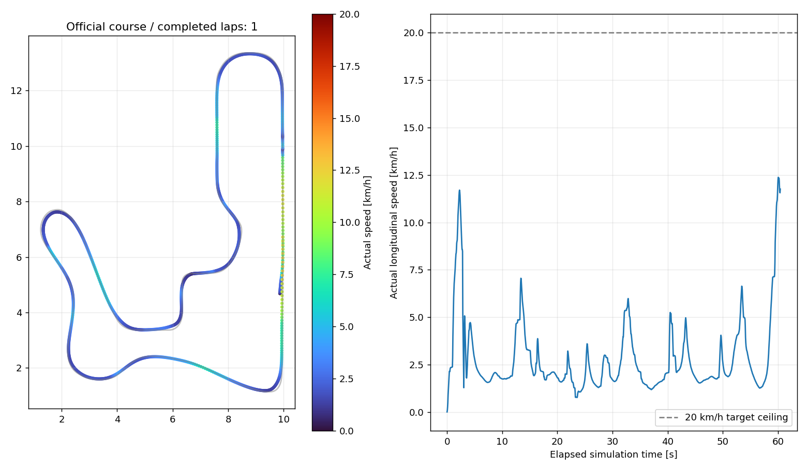

# IT ARENA 자율주행 시뮬레이션 중간 보고서

**기준일: 2026년 9월 8일**

이 문서는 현재 로컬 개발본과 저장된 시험 결과를 기준으로 작성했습니다. 보고서 게시가
본문에 설명한 모든 개발 소스의 GitHub 반영을 뜻하지는 않습니다. 실물 차량의 성능 보고서가
아니며, 센서 구매·배치나 임시 물성값을 팀의 최종 결정으로 확정하는 문서도 아닙니다.

## 1. 현재 어디까지 진행했는가

현재는 **공식 코스를 기반으로 단독 차량이 신호등을 보고 출발하고, 센서로 길을 따라
본선을 한 바퀴 도는 알고리즘 실험 환경**을 확보한 상태입니다.

- LiDAR 기반 벽 추종과 D435i급 RGB-D 기반 노면 추종을 선택해 시험할 수 있습니다.
- 차량은 화면 속 물체를 정해진 좌표로 옮기는 방식이 아닙니다. 모터 토크, 바퀴 접촉,
  조향, 질량을 물리 엔진에서 계산하며 헛돎·미끄러짐·차체 들림이 발생할 수 있습니다.
- 최근에는 10 Hz 회전식 LiDAR의 순차 측정과 엔코더·자이로 기반 운동 보정을 추가했습니다.
- 결합 보정은 별도 직선 시험에서 목표 20 km/h 주행·제동을 두 번 통과했습니다.
  **공식 코스 최신 영상의 실제 최고속도는 12.38 km/h이며, 20 km/h 완주는 아직 아닙니다.**
- 다른 차량 추적·추월·경쟁 주행, 방지턱 사전 인식, 지도 작성과 경주선 최적화는 미구현입니다.

즉, 현재 성과는 “실차가 나오기 전에 알고리즘을 비교하고 실패를 관찰할 기반”입니다.
아직 “실제 대회에서 안전하게 고속 주행할 완성 프로그램”은 아닙니다.

## 2. 현재 차량은 무엇을 보고 움직이는가

### 2.1 LiDAR 주행: 한쪽 벽을 기준으로 본선 추종

현재 주된 시험 대상은 **벽 곡선 추정 + 거리·방향 오차 피드백**입니다.
미리 저장한 정답 경주선을 따라가는 방식이나 학습형 자율주행은 아닙니다.

1. LiDAR가 측정한 거리들을 차량 주변의 점으로 바꿉니다. 보정을 켠 시험에서는
   차량이 측정 중 움직인 만큼 점의 위치를 먼저 보정합니다.
2. 왼쪽 또는 오른쪽 벽에 해당하는 점들을 고르고, 이상점을 일부 제외한 뒤
   **2차 곡선**으로 근사합니다. 여기서 벽까지 거리, 벽의 방향, 굽은 정도를 구합니다.
3. 벽과 목표 간격을 유지하도록 방향을 수정하고, 벽이 굽어 있으면 그 곡률을 미리 반영합니다.
   너무 가까우면 멀어지는 방향으로, 너무 멀면 가까워지는 방향으로 조향합니다.
4. 계산한 경로 곡률을 차량 축거에 맞는 조향각으로 변환합니다.
   조향각 크기와 급격한 조향 변화에도 제한을 둡니다.

이 제어기는 **LiDAR 기반 Pure Pursuit나 Stanley 구현은 아닙니다**. 현재 LiDAR 모드는
벽의 곡률을 이용한 선행 조향과 거리·방향 오차 보정을 합치는 단순한 방식입니다.
벽을 안정적으로 추정하지 못하면 정지 명령을 내립니다.

### 2.2 신호등과 갈림길

- **신호등:** RGB 영상에서 빨간 렌즈를 먼저 확인하고, 같은 신호등에서 초록 렌즈가
  연속으로 보이면 출발합니다. 시뮬레이터의 신호 상태나 정해진 출발 시간을 읽지 않습니다.
  다만 현재 임시 신호등의 색·렌즈 배치에 맞춘 방식이므로 실물 시설에 맞춘 조정은 필요합니다.
- **갈림길:** RGB 영상에서 ArUco ID를 읽어 따라갈 벽을 바꿉니다. 현재 규칙은
  ID 30에서 오른쪽 벽, ID 0/20/45에서 왼쪽 벽입니다. 이는 **지름길을 피하고 본선을
  도는 시험용 규칙**이며, 최단 경로를 계산하거나 지름길의 이득을 판단하는 기능은 아닙니다.
- 일반 데모는 출발 후 계속 주행합니다. 영상 시험에서는 별도 검증기가 한 바퀴 진행을
  확인하고 종료를 요청했습니다. 이 평가용 위치 정보는 조향기의 입력이 아닙니다.

### 2.3 스테레오 주행: RGB 노면 후보 + 깊이 확인 + Pure Pursuit

비교용 스테레오 모드도 남겨 두었습니다. 현재는 다음 순서로 동작합니다.

1. RGB 영상에서 회색 노면으로 보이는 영역을 찾습니다.
2. 깊이 영상으로 그 영역이 평지에 해당하는지 확인합니다.
3. 가까운 노면 중심에 목표점을 잡고, 그 점을 향해 원호로 접근하는 **Pure Pursuit**로 조향합니다.
4. 한쪽 경계만 보일 때는 본선 명목 폭 0.45 m로 중심을 추정합니다.
5. 목표점을 얻지 못하면 깊이 영상의 열린 통로·벽 거리 기반 저속 복구를 시도합니다.

**깊이만으로 도로와 잔디를 구별하거나, 다른 차량에 가린 도로를 복원하는 구현은 아닙니다.**
현재 코스의 색과 평지 가정에 의존하며, 실물 RGB-깊이 정렬·조명·차량 가림은 추가 검증이 필요합니다.
스테레오는 저속 비교 단계이고, 이번 고속 운동 보정 시험은 LiDAR 모드에 대한 것입니다.

## 3. 가속과 감속은 어떻게 결정하는가

속도는 “직선 구간 번호에서는 가속, 코너 번호에서는 감속”으로 지정하지 않았습니다.
**현재 보이는 벽의 곡률과 전방 여유를 이용해 매 제어 주기마다 목표속도를 다시 정합니다.**

```text
센서로 벽·노면을 해석
        ↓
조향각과 주행 목표속도 계산
        ↓
곡률·전방 거리·횡가속 제한 / 가속 속도 제한
        ↓
ToF 추가 감속·정지층 — 일반 실행에서 활성
        ↓
바퀴 평균 속도와 목표속도의 차이로 모터 토크 제어
        ↓
기계식 차동·타이어 접촉을 거쳐 실제 차량 운동 발생
```

### 3.1 LiDAR 모드의 목표속도

현재 코드에는 다음 제한이 겹쳐 적용됩니다.

| 제한 | 실제 역할 |
|---|---|
| 속도 프로필 상한 | 시험별로 허용할 최대 요청 속도를 설정 |
| 곡률 기반 감속 | 벽과 목표 경로가 많이 굽을수록 속도를 낮춤 |
| 전방 거리 기반 감속 | 차량 앞의 좁은 진행 영역에 물체가 가까우면 속도를 낮춤 |
| 횡가속 제한 | 조향 곡률이 클 때 `속도² × 곡률`이 설정 한도를 넘지 않도록 제한 |
| 증속 제한 | 목표속도가 올라가도 명령을 한 번에 크게 올리지 않음 |
| 위험·입력 오류 정지 | 근접 물체, 벽 추정 실패, 오래된 센서값, 보정 실패 등에서 0 속도 요청 |

구체적으로 곡률 감속은 `상한 속도 / (1 + 0.55 × |곡률|)`, 전방 거리 감속은
`(전방 거리 − 0.15 m) × 0.6`을 바탕으로 합니다. 정상 추종 중 최저속도 설정도 있지만,
위험 정지는 그보다 우선합니다. 이것들은 실험용 경험식이며 제동거리를 보장하는 정식
속도 계획기는 아닙니다. 횡가속 제한도 실측 타이어 성능 대신 임시값을 사용합니다.

| 일반 속도 프로필 | 요청 상한 | 명령 증속 한도 |
|---|---:|---:|
| 기본 저속 `cautious` | 1.26 km/h | 0.5 m/s² |
| 저속 비교 `brisk` | 2.52 km/h | 0.8 m/s² |
| 탐색 `exploratory` | 5.04 km/h | 1.0 m/s² |
| 하드웨어 목표 `hardware_target` | 20 km/h | 1.5 m/s² |

**상한은 실제 달성 속도가 아닙니다.** 곡률·전방 거리·ToF 제한이 더 낮으면 그 제한이
적용되고, 실제 가감속은 모터 토크와 접지에 따라 달라집니다. 감속 명령은 곧바로 낮출 수
있지만 차체가 순간 정지하는 것은 아닙니다.

최신 공식 코스에서 20 km/h에 못 미친 것은 LiDAR 10 Hz의 절대 한계를 확정한 결과가
아닙니다. 현재 반응형 감속 정책과 차량 응답이 함께 적용된 결과이며, 각 제한이 최고속도에
기여한 비율은 아직 분리 분석하지 않았습니다.

스테레오 모드도 목표점 방향·전방 깊이 여유와 저속 제한을 이용합니다. 두 모드의
제어 정책과 센서가 다르므로 영상의 속도만으로 LiDAR와 카메라 제품의 우열을 판단할 수 없습니다.

### 3.2 ToF는 경로 회피가 아니라 추가 감속·정지

일반 실행에서는 ToF 관측으로 현재 조향을 유지할 때 차량이 지나갈 영역을 검사합니다.
정적 장애물에 대해 `속도 × 반응 지연 + 속도² / (2 × 감속도)`로 정지거리를 근사하고,
관측값이 오래될수록 더 보수적으로 제한합니다.

현재 낮은 표적의 검출 거리 가정은 0.5 m여서 빈 공간에서도 약 1 m/s 안팎 이하로
제한될 수 있습니다. **ToF로 비켜갈 경로를 만들거나 상대 차량의 접근 속도를 추적하지는 않습니다.**
최근 독립 고속 시험과 공식 고속 촬영에서는 명시적으로 ToF 보호를 껐습니다.
그 결과를 ToF가 켜진 상태의 고속 충돌 회피 성능으로 해석하면 안 됩니다.

### 3.3 목표속도를 실제 운동으로 만드는 하위 제어

모터는 하나이며 좌우 뒷바퀴 평균 속도를 목표와 비교하는 **PI 제어**로 토크를 결정합니다.
모터 토크·제동 한계와 응답 지연을 두고, 실제 바퀴에는 회전속도를 강제로 지정하지 않고
토크를 가합니다. 앞바퀴는 중앙 조향 명령을 Ackermann 관계로 좌우 각도에 나누어
가상 서보로 제어합니다.

따라서 바퀴가 헛돌면 “바퀴 기준 속도는 높지만 차체는 느린” 상황도 가능합니다.
바퀴 속도를 실물 지면 속도나 실제 정지의 완전한 증거로 보지는 않습니다.

## 4. 시뮬레이션 구현 범위

### 4.1 환경과 코스

- Windows의 WSL Ubuntu 24.04에서 ROS 2 Jazzy·Gazebo Harmonic을 사용합니다.
- 현재 코스 기준은 주최 측 `v2026.09.02`입니다. 본선 폭 0.45 m, 지름길 폭 0.20 m와
  공식 출발 슬롯 6개를 반영했습니다. 공식 배포 원본은 버전별로 별도 보존합니다.
- 팀 실행본은 마커를 주행 중 보기 좋게 기울였습니다. 신호등의 형상·동작 주기,
  방지턱 곡선 단면·접촉 분할·색띠 등은 아직 임시 구현입니다.
- 방지턱 명목 길이 5 cm·높이 1 cm와 달리, 임시 곡면이 최종 실물 형상까지 재현한다는 뜻은 아닙니다.
- 공식 벽의 마찰계수는 보존하지만 노면·타이어의 실측 마찰은 확보하지 못했습니다.

### 4.2 차량과 동역학

| 항목 | 현재 구현 | 확정 여부·한계 |
|---|---|---|
| 전체 외형 | 길이 20 cm × 폭 15 cm | 팀 설계 목표 확정, 완성차 실측 아님 |
| 축거·윤거·바퀴 | 14.5 cm·13.5 cm·지름 5 cm | 임시값, 변경 가능 |
| 질량 | 약 2.000 kg | 사용자 예상에 맞춘 값, 실제 부품 계량 아님 |
| 구동 | 모터 1개 + 후륜 기계식 차동 | 현재 구현 기준선 |
| 차동 특성 | 이상적 오픈 / 손실 있는 오픈 / 점성 LSD 근사 선택 | 실제 기어·클러치 상세 아님 |
| 조향 | Ackermann 기하와 토크·응답 제한을 가진 가상 서보 | 링크 유격·실물 서보 교정 미반영 |
| 엔코더 | 후륜 2개, 2048틱/회전·100 Hz·추가 지연 2 ms | 실험용 사양 |
| 물리 운동 | 질량·관성·마찰·충돌·슬립·차체 3차원 운동 | 실물 물성 검증 전 |
| 후방 식별판 | 5×5 cm, 시험용 ArUco ID 10 | 정확한 공식 ID·장착 세칙 미확정, 시각 요소 |

오픈 차동은 좌우 바퀴를 같은 회전속도로 묶지 않습니다. 모터는 평균 속도를 제어하고,
이상적인 경우 좌우에는 같은 토크를 전달합니다. 접지가 나쁜 쪽만 헛도는 상황도 표현됩니다.

아직 전류·전압·ESC 정류·발열, 기어 백래시, 서스펜션 상세, 타이어 변형과 실제 부품 CAD는
재현하지 않습니다. ESP32 후보와 제어 역할은 논의되어 있으나 실제 MCU 펌웨어·배선·통신의
차량 통합 시험이 완료된 것은 아닙니다.

### 4.3 센서

| 센서 | 구현한 내용 | 중요한 미재현 요소 |
|---|---|---|
| D435i급 RGB-D | RGB·깊이·카메라 정보·IMU 인터페이스, 선택형 주행 | 실물 스테레오 매칭 실패·노출·RGB-깊이 정렬·USB 지연 전체 |
| C1급 LiDAR | 거리 스캔, 순간 취득과 순차 회전 취득 비교 | 실물 반사율·통신·점별 시각 계약 전체 |
| VL53L7CX급 ToF | 영역 중심 광선, 기본 8×8·15 Hz, 비교 4×4·60 Hz | 영역 적분·외광·다중 표적·센서 간 간섭 전체 |
| 후륜 엔코더 | 두 바퀴의 양자화·표본화·지연 | 실물 장착 오차·전기 잡음 전체 |
| IMU 자이로 | 운동 보정용 각속도 | 실물 온도 변화·바이어스·진동 교정 |

비교 구성은 **LiDAR+ToF6, 전방 RGB는 신호·마커용**과 **전방 D435i RGB-D+측면 ToF4**입니다.
네 ToF 구성에는 정후방·전방 중앙 ToF가 없으며, 센서의 명목 시야각 합이 실제 무사각을 뜻하지 않습니다.
이 배치는 개인 제안에 따른 실험안으로, 팀 합의와 예산에 따른 최종 장착 결정은 별도입니다.

## 5. 최근 추가한 회전식 LiDAR 운동 보정

10 Hz 스캔은 한 바퀴를 만드는 데 약 0.1초가 걸립니다. 현재 순차 모델은 회전 중 서로
다른 시각의 광선에서 500점을 모읍니다. 원시 광선 계산은 기본 500 Hz이고,
점별 시간 근사 오차는 이전 시험에서 최대 약 1.8 ms였습니다. “500점 전체를 동시에 측정”한
순간 스캔과 구분해 시험합니다.

차가 움직이는 동안 앞부분과 뒷부분의 점을 같은 시각에 측정한 것처럼 쓰면 벽 형상이
왜곡될 수 있습니다. 이를 보정하기 위해 후륜 엔코더로 전진량, 자이로로 회전량을 추정합니다.

| 모드 | 보정하는 시간 구간 |
|---|---|
| 무보정 | 좌표 이동 보정 없음 |
| 내부 보정 `deskew` | 각 점의 측정 시각 → 마지막 점 측정 시각 |
| 이후 이동 보정 `shift` | 스캔 종료 시각 → 현재 제어 시각 |
| 결합 `both` | 각 점의 측정 시각 → 현재 제어 시각 |

이것은 짧은 시간 동안의 상대 이동 보정이며 **SLAM이나 코스 안의 절대 위치 추정은 아닙니다**.
Gazebo 정답 위치·자세는 보정이나 조향 입력으로 사용하지 않습니다. 입력이 부족하거나
너무 오래되면 보정을 거부하고 정지 명령을 내립니다.

현재는 평면 운동 근사이므로 슬립·큰 차체 기울기·움직이는 다른 차를 완전히 보정하지 못합니다.
보정된 점도 과거 관측입니다. 관측 주기가 빨라지거나 가려진 물체가 새로 보이는 것은 아닙니다.
또한 기본 실행은 이전 결과 보존을 위해 무보정이며, 새 시험에서 순차 취득과 결합 보정을 명시했습니다.

## 6. 시험 결과와 해석

### 6.1 독립 시험장: 보정 효과 비교

같은 차량·조향 이득·10 Hz 조건에서 별도 직선과 반경 1 m 커브를 시험했습니다.

| 시험 | 결과 |
|---|---|
| 직선 15 km/h | 순차 무보정 실패, 내부만·이후만·결합과 순간 대조군 통과 |
| 직선 20 km/h | 첫 비교에서 결합만 주행·제동 통과; 이후만은 주행 중 이탈 없었지만 제동 중 이탈 |
| 결합 직선 20 km/h 재시험 | 통과, 결합은 총 2/2회 통과 |
| 반경 1 m 커브 8 km/h | 무보정 포함 다섯 모드 모두 통과 |
| 결합 직선 5/10·커브 5/10 km/h | 통과 |

독립 주행은 총 20회이며 그중 이탈한 5회는 실패 기록으로 남겼습니다. 모든 독립 실행의
센서 취득·실제 정지·프로세스 정상 종료는 확인했습니다. 단위·회귀 검사는 최종 208개 통과했습니다.

**결론은 “10 Hz라도 운동 보정이 도움이 되었다”입니다.** “10 Hz로 실차 20 km/h가 안전하다”거나
“보정 없이는 커브를 못 돈다”는 결론은 아닙니다. 반복 횟수가 적고 실물 잡음·지연이 이상화되어 있습니다.

### 6.2 공식 본선: 최신 LiDAR 영상

| 항목 | 관측 결과 |
|---|---|
| 설정 | 순차 10 Hz + 결합 보정, 제어 100 Hz, ToF 보호 해제한 단독 시험 |
| 진행 거리 | 본선 한 바퀴+약 2 m, 총 48.67 m |
| 실제 최고속도 | 12.38 km/h — 목표 상한 20 km/h에는 미달 |
| 주행 중 시간 가중 평균속도 | 약 2.82 km/h |
| 신호·마커 | 조기 출발 없음, 코스 ID 0/20/30/45 검출 |
| 벽 겹침 평가 | 평면 차량 외형과 정적 벽의 겹침 표본 0개 |
| 남은 주행 문제 | 짧은 벽 추정 실패 2회, 방지턱에서 최대 피치 약 43° |
| 종료 검증 | 정지 확인 제한시간 초과·Gazebo 강제 종료로 종합 미통과 |

본선은 돌았지만 마지막 실제 정지를 확인하지 못했습니다. 느린 시뮬레이션 대비 정지
검사 시간이 부족한 정황은 있으나, 최종 제동 기록이 부족해 원인을 확정하지 않았습니다.
이후 Gazebo 종료 오류도 별개로 발생했습니다. **완주, 안전성, 정상 종료를 구분해야 합니다.**

[최신 3인칭 영상 — 시뮬레이션 시간 1배속, 60.5초](../../artifacts/validation/2026-09-08/lidar_motion/official_video_v1/lidar_third_person_simtime_1x.mp4)



그래프의 점선은 20 km/h 목표 상한입니다. 차량이 그 속도로 달렸다는 표시가 아닙니다.
영상은 일반 플레이어에서 재생할 수 있으며 GitHub 화면에서 재생되지 않으면 내려받아 확인합니다.

### 6.3 스테레오와 기존 저속 기준선

9월 4일 선택형 시험에서 LiDAR와 스테레오 모두 본선 약 48.65 m 주행과 실제 정지를
확인하고 각각 영상을 남겼습니다. 다만 스테레오는 깊이 30 Hz 요청에 약 23.98 Hz 전달,
Gazebo 종료 오류가 남아 종합 검사는 미통과였습니다. 해당 30 Hz는 실행 설정이며
D435i 제품의 모든 모드 중 최대 프레임률을 의미하지 않습니다.

최근 LiDAR 보정 성과를 스테레오 고속 성능으로 승계하지 않으며, 두 모드의 비교 영상만으로
센서 구매 결론을 내리지 않습니다.

## 7. 실행 속도와 실차 적용의 한계

시뮬레이터가 실제 시간보다 느리게 계산하는 것과 차량이 시뮬레이션 안에서 느리게
달리는 것은 별개입니다. 물리 시간의 속도와 센서 주기는 유지하므로 고속에서는 측정
사이 이동량·슬립·충돌 결과가 달라집니다. 영상은 그 시뮬레이션 시간을 기준으로 재생합니다.

GPU 렌더링 경로를 확인했고 순차 LiDAR 별도 직선 시험에서는 전체 실행 시간이 약 33%
줄었습니다. 그러나 공식 코스의 많은 충돌 형상과 고빈도 광선 계산 비용이 남아
실시간 실행을 달성하지 못했습니다. 충돌 검출기 변경은 속도 이득과 함께 물리 궤적도
달라져 이번 보정 비교의 기본 설정에는 적용하지 않았습니다. GPU 종료 오류도 미해결입니다.

실차 적용 전에는 다음을 반드시 새로 확인해야 합니다.

- C1 드라이버의 점별 측정 순서·시각, 센서와 제어기 사이의 시간 기준.
- 바퀴 유효 반지름·엔코더 방향과 분해능, 자이로 영점·장착 방향·시간 지연.
- 실제 무게중심·타이어 마찰·조향 응답·모터/ESC 제동거리와 슬립.
- 센서 장착 가림·낮은 상대 차량 검출·실제 조명과 마커 인식.
- Jetson 처리율, MCU 통신 단절 감시와 독립 정지 수단.

따라서 시뮬레이션 코드는 실차 개발의 출발점으로 재사용할 수 있지만, 실차에서 바로
같은 속도로 시험할 근거는 아닙니다.

## 8. 다음 단계와 팀 협의 사항

1. **방지턱 인식과 사전 감속:** 다음 검토 주제로 정했습니다. 현재 들림 관측을 근거로
   카메라 인식 가능 거리와 필요한 감속 거리를 함께 확인해야 합니다. 아직 구현 전입니다.
2. **기본 주행 신뢰성:** 벽 추정 끊김과 과도한 저속 구간을 분석하고, 마지막 제동 기록과
   시뮬레이션 시간 기준 정지 검사를 보강해야 합니다.
3. **하드웨어 값 반영:** 축거·윤거·센서 위치·질량·구동 응답을 실제 설계/측정값으로 교체해야 합니다.
4. **센서 구성 합의:** 예산과 장착 가능성을 바탕으로 LiDAR/RGB-D, ToF 수량과 사각지대,
   D435i를 빼는 경우 운동 보정용 별도 IMU 유지 여부를 결정해야 합니다.
5. **단독 주행 이후:** 정적 장애물 정지 → 느린 상대 차량 추종·정지 → 회피·추월 순으로
   확대하는 안을 제안합니다. 이것은 제안이며 팀이 확정한 개발 일정은 아닙니다.

자기 위치 추정·지도 작성·경주선·Pure Pursuit/Stanley·최적화 기반 제어 등은 이후 비교
후보입니다. 현재 벽 추종 기준선의 한계를 측정한 뒤 도입 여부를 결정할 수 있습니다.

## 부록: 확인 근거

이 보고서는 새 주행을 추가하지 않고 현재 코드와 기존 기록을 대조해 작성했습니다.

- [최신 공식 주행 원문](../../artifacts/validation/2026-09-08/lidar_motion/official_video_v1/report.json)
- [최신 속도·자세 재집계](../../artifacts/validation/2026-09-08/lidar_motion/official_video_v1/lap_analysis.json)
- [영상 시간 검증](../../artifacts/validation/2026-09-08/lidar_motion/official_video_v1/video_timing_audit.json)
- [독립 15 km/h 비교](../../artifacts/validation/2026-09-08/lidar_motion/boundary15_v1/summary.json) · [20 km/h 비교](../../artifacts/validation/2026-09-08/lidar_motion/boundary20_v1/summary.json)
- [커브 8 km/h 비교](../../artifacts/validation/2026-09-08/lidar_motion/circle8_v1/summary.json) · [결합 보정 회귀 시험](../../artifacts/validation/2026-09-08/lidar_motion/combined_regression_v1/summary.json)
- [최종 자동 검사 결과](../../artifacts/validation/2026-09-08/lidar_motion/unit_results_v6.xml)
- [기존 선택형 두 모드 검증](../../artifacts/validation/2026-09-04/selectable_autonomy/README.md)
- [차량 동역학 설명](../simulation/VEHICLE_DYNAMICS.md) · [ToF 감속·정지 설명](../autonomy/TOF_SAFETY.md)

알고리즘은 로컬 개발본의 `core.py`, `wall_follow.py`, `stereo_road.py`, `lidar_motion.py`와
실행 설정을 확인했습니다. 세부 수치의 원문과 실패 기록은 삭제하거나 성공으로 덮어쓰지 않았습니다.
