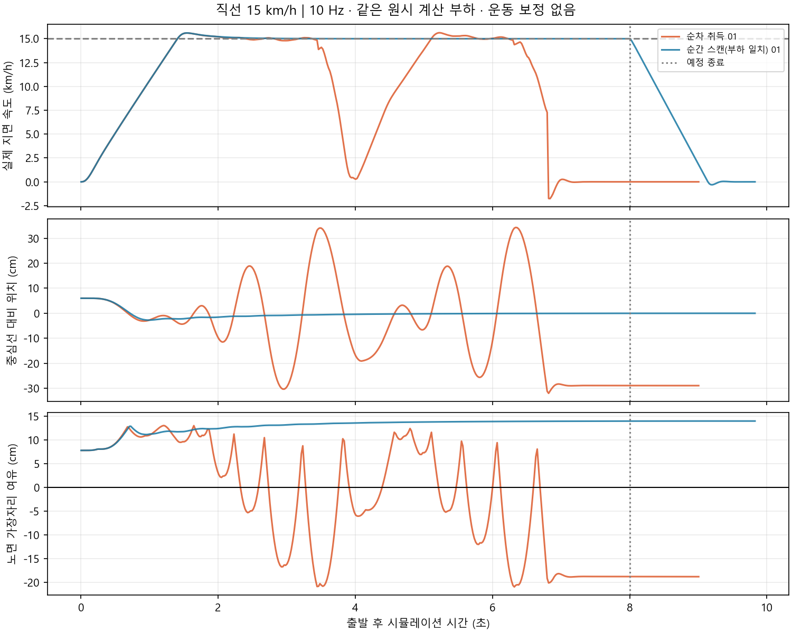

# C1급 10 Hz 순차 회전 취득: 구현과 속도 시험

작성: 2026-09-06. 예산 협의 근거용이며 제품 구매 결정이나 실차 안전 인증이 아닙니다.

후속: [2026-09-08 운동 보정 구현·시험](LIDAR_MOTION_IMPLEMENTATION.md)은 새 실행으로 분리했습니다. 아래 무보정 결과를 덮어쓰지 않으며 보정 후 실험 결과와 구분합니다.

## 회의용 핵심 결과

같은 10 Hz·차량·조향기·원시 계산 부하로 비교한 최초 14회의 결과입니다.

추가로 15 km/h 직선 한 쌍을 다시 실행했습니다. **순간 스캔은 합계 2/2회 통과, 순차 취득은 0/2회 통과**로 같은 결과였습니다. 두 번의 순차 실행 최대 중심선 위치 차이는 각각 34.31·34.30 cm였습니다. [추가 재시험 표·그래프](../../artifacts/validation/2026-09-06/rotating_lidar/boundary_repeat_v1/RESULTS.md)를 보존합니다. 적은 반복 횟수이므로 실패 확률을 추정한 통계로 표현하지 않습니다.

| 시험 조건 | 순간 스캔 | 순차 취득, 운동 보정 없음 |
|---|---|---|
| 직선 5·10 km/h | 각 통과 | 각 통과 |
| 직선 15 km/h | 통과 | 도로 이탈, 미통과 |
| 직선 20 km/h | 통과 | 도로 이탈·평가 외형 벽 겹침으로 조기 중단 |
| 반경 1 m 커브 5·8·10 km/h | 각 통과 | 각 통과 |

**시험한 속도 중 순차 모델이 통과한 최고 목표속도는 직선·해당 커브 모두 10 km/h입니다.** 정확한 최대속도를 찾은 것은 아닙니다. 10~15 km/h 사이를 세밀하게 탐색하지 않았고, 경로·제어기·실차 물성이 바뀌면 결과도 바뀝니다. 10 km/h의 실제 경주 안전을 보장하지 않습니다.

직선 15 km/h 순차 모델은 실제 최고 15.62 km/h에 도달했지만 좌우 진동이 커지며 약 2.33초부터 노면을 이탈했습니다. 이후 가까운 벽에 따른 정지 명령이 3.50초, 벽 추정 실패가 6.80초부터 기록됐습니다. 최대 중심선 위치 차이는 34.31 cm였습니다. 순간 스캔은 같은 출발 오프셋 6 cm에서 중심선으로 수렴했습니다.

20 km/h 순차 모델도 실제 최고 20.39 km/h까지 올라갔습니다. 따라서 낮은 모터 출력이나 기존 데모 속도 상한 때문에 실패한 것이 아닙니다. 약 2.04초부터 노면을 이탈했고 목표 ±5% 유지 시간은 약 0.81초로 기준에 못 미쳤습니다. 주행 중 최대 중심선 위치 차이는 재집계 기준 32.85 cm입니다. 제동까지 합친 최대값과 구분합니다.

본 비교 14회 모두 센서 취득 검증과 정상 종료를 통과했습니다. 10 Hz 간격이 유지됐고 원시 광선 시간 근사 오차는 최대 1.8 ms, 원시 공백으로 폐기한 회전은 0회였습니다. 이 두 실패는 센서 수신 자체가 끊겨 생긴 실패가 아닙니다.

추가 재시험 2회도 센서 취득·실제 정지·정상 종료를 확인했습니다. 본 비교와 재시험 합계 16회, 실행별 21개씩 총 336개의 자식 프로세스 종료 기록이 모두 정상입니다. 초기 5 km/h 1000 Hz 원시 스모크 1회는 별도이며 합계 16회에 포함하지 않습니다.

회의에서는 다음과 같이 설명하는 것이 적절합니다.

> 10 Hz 라이다도 저속·일정한 커브 추종은 가능했습니다. 그러나 순간 스캔에서는 통과하던 직선 15·20 km/h가 순차 회전을 반영하자 현재의 무보정 단순 제어에서 실패했습니다. 고속을 목표로 한다면 값싼 라이다만 붙이면 끝나는 구성이 아니라, 운동 보정·예측·제어 개선 또는 더 빠른 관측 수단에 대한 개발 시간과 예산을 함께 고려해야 합니다.

이는 C1으로 고속 주행이 원천적으로 불가능하다거나 비싼 센서만 사면 해결된다는 주장이 아닙니다. 다음 비교는 엔코더·IMU 기반 deskew와 스캔 사이 예측을 단계적으로 추가하는 것이 유용합니다. RGB로 경로를 잡고 C1으로 근접 간격을 감시하는 후보는 이번 라이다 단독 조향 시험과 다른 구조이며 별도 검증해야 합니다.



아래쪽 그래프의 노면 여유가 0 cm보다 작아지면 평가 외형이 도로 밖으로 나간 것입니다. [모든 속도 표·그래프](../../artifacts/validation/2026-09-06/rotating_lidar/matched_matrix_v1/RESULTS.md)에는 통과한 조건도 함께 있습니다.

## 무엇을 구현했는가

- 회전 10 Hz, 한 바퀴 500점, 명목 점 취득 간격 0.2 ms입니다. C1 제조사의 대표 회전수·점 수집률을 따른 근사입니다.
- Gazebo가 서로 다른 시각에 계산한 거리값에서 회전 각도에 해당하는 광선을 차례로 선택합니다. 차량 이동·회전 중 생기는 스캔 내부 형상 왜곡을 포함합니다.
- 기본 원시 광선 계산은 500 Hz입니다. 점별 실제 계산 시각은 명목 시각보다 최대 약 2 ms 이전이며, 2.1 ms를 넘는 원시 프레임 공백은 해당 회전을 폐기하고 검증 실패로 처리합니다. 5 kHz 물리 계산은 아닙니다.
- 완성된 100 ms 회전을 한 묶음으로 발행합니다. `/scan`의 헤더는 첫 점 취득 시각이고 점 간격도 기록합니다. 스캔 내부 운동 보정(deskew)은 아직 하지 않습니다.
- 실물 회전 방향·회전 시작 위상·드라이버의 부분 스캔 전달 여부는 확인하지 않았습니다. 현재 각도 증가 순서를 사용합니다. 실물 통신 지연·반사율·검은 표면 결측·거리 잡음까지 재현한 것은 아닙니다.

제조사: [C1 사양](https://www.slamtec.com/en/c1/spec). 메시지 시각 정의: [ROS LaserScan](https://github.com/ros2/common_interfaces/blob/jazzy/sensor_msgs/msg/LaserScan.msg).

## 무엇을 비교하는가

`snapshot_matched`와 `sequential` 모두 같은 고빈도 원시 광선 계산과 전달 경로를 거칩니다. 앞의 방식은 회전 완료 시각의 순간 스캔을, 뒤의 방식은 회전 중 모은 스캔을 전달합니다. 따라서 단순히 한쪽만 계산량을 크게 늘린 비교가 아닙니다.

이 비교에서 함께 바뀌는 것은 점들의 취득 시각과 한 회전 수집에 따른 관측 나이입니다. 따라서 차이가 나더라도 이를 **스캔 형상 왜곡만의 효과**라고 분리해서 주장하지 않습니다. 지연만 추가한 순간 스캔, 순차 취득+deskew, 스캔 사이 예측은 아직 별도 대조군이 없습니다.

차량 2 kg, 임시 모터·서보·타이어 물성, 100 Hz 벽 추종 제어기는 같습니다. 조향기는 라이다와 시계만 사용합니다. 위치 정답은 평가에만 사용합니다. 빈 독립 시험장에서 고정 목표속도를 요청하므로 일반 데모의 2.52 km/h 상한·전방 거리 비례 감속·ToF 보호는 이 시험에 적용하지 않습니다. 공식 코스와 일반 데모는 변경하지 않았습니다.

직선과 반경 1 m 커브를 따로 봅니다. 도로 폭 45 cm, 벽 사이 85 cm이며, 평가 상자는 보수적으로 20×17 cm입니다. 차량 설계 외형 20×15 cm를 바꾼 것이 아닙니다. 일정 곡률의 빈 시험장은 공식 트랙의 급격한 곡률 변화·분기·차량 가림을 대표하지 않습니다.

통과는 목표 속도 ±5%에서 연속 2초 이상 유지, 8초 주행, 정지까지 평가 상자 노면 이탈 없음, 벽 겹침 없음, 실제 안정 정지, 센서·제어 계측 정상, 모든 자식 프로세스 정상 종료를 모두 요구합니다. 실패에는 센서 한계 외에 단순 조향기의 한계와 제동 중 이탈도 포함될 수 있습니다.

주기·속도·지연은 모두 시뮬레이션 시간 기준입니다. 고빈도 광선 계산 때문에 실제 컴퓨터에서는 느리게 실행되지만, 이를 차량이 느리게 달린 것으로 해석하지 않습니다. 반대로 이 PC에서 시험이 돌아갔다고 Jetson의 실시간 처리 성능을 확인한 것도 아닙니다.

## 회의에서 설명할 수 있는 시간·거리 규모

| 차량 속도 | 같은 방향을 다시 보는 0.1초 동안 이동 | 20 cm 차량 길이 대비 |
|---|---:|---:|
| 5 km/h | 13.9 cm | 0.69배 |
| 10 km/h | 27.8 cm | 1.39배 |
| 15 km/h | 41.7 cm | 2.08배 |
| 20 km/h | 55.6 cm | 2.78배 |

이 거리는 계산값이지 곧바로 횡방향 오차나 충돌거리라는 뜻이 아닙니다. 반복 관측 사이에 그만큼 상황이 바뀔 수 있다는 뜻입니다. 반경 1 m를 20 km/h로 따라간다는 기하학적 가정에서는 0.1초에 약 31.8° 회전하므로, 한 회전 안의 점들을 같은 차량 자세에서 본 것처럼 처리하기 어렵습니다. 해당 커브 속도의 물리적 가능성을 검증한 계산은 아닙니다.

한 바퀴를 모아 발행하면 첫 점은 발행 순간 이미 약 100 ms 전의 관측입니다. 다음 스캔까지 기존 값을 쓰면 첫 점 기준 나이는 약 100~200 ms가 됩니다. 그러나 모든 점이 그만큼 오래된 것은 아닙니다. 현재 회전 위상에서 전방 점은 대략 회전 중간에 취득하며, 헤더의 나이를 그대로 전방 관측 지연이라고 설명하면 과장입니다.

빠른 라이다는 재관측 공백과 스캔 내부 시간차를 줄이는 선택지입니다. 반면 엔코더·IMU 기반 운동 보정은 이미 얻은 점의 차량 운동 왜곡을 줄이고, 스캔 사이 예측은 제어 시각까지 경로를 옮기는 역할입니다. 보정한다고 아직 보지 못한 상대차가 보이거나 10 Hz가 40 Hz가 되지는 않습니다.

## 결과와 재현

후속 구현에 필요한 시간 계약·엔코더/자이로 입력·네 가지 보정 조합과 오차 시험 계획은
[회전식 라이다 보정 조사](ROTATING_LIDAR_COMPENSATION_RESEARCH.md)에 정리했습니다.
2026-09-06 자료 조사만 추가한 것이며 아래 기준선에 보정 구현이나 새 주행 결과를 섞지 않습니다.

초기 구현의 1000 Hz 원시 광선 스모크는 5 km/h 직선 추종·정지를 통과했습니다. 이는 본 비교 행렬과 별도 실행이며 소스 해시도 해당 실행에 보존합니다.

- 초기 스모크: `artifacts/validation/2026-09-05/rotating_lidar/straight5_sequential_01/report.json`
- 부하 일치 비교: `artifacts/validation/2026-09-06/rotating_lidar/matched_matrix_v1/`
- 상세 결과 표·그래프: 해당 폴더의 `RESULTS.md`.
- 최초 보고서의 조기 중단 집계는 제동 표본 일부를 주행 통계에 포함했습니다. 원문은 보존했고, 최종 표는 각 폴더 `phase_audit.json`으로 분리 재집계했습니다. 14회의 통과·실패 판정은 바뀌지 않았습니다.

```bash
# 기존 기본값은 snapshot으로 보존합니다. 순차 취득을 명시적으로 선택합니다.
ros2 launch arena_bringup demo.launch.py lidar_acquisition:=sequential lidar_rate_hz:=10

# 빈 독립 시험장: 기존 데모와 달리 고정 목표속도·ToF 보호 해제
python3 scripts/validate_lidar_control_lab.py --case straight_10kmh --rate 10 --acquisition sequential --source-rate 500 --output artifacts/validation/새로운_실행_폴더
```

이 실험의 목적은 '10 Hz는 불가능하다'는 주장을 만드는 것이 아닙니다. 통과한 조건과 실패한 조건을 함께 제시하고, 고속 경주에 필요한 보정·예측·센서 선택의 비용을 판단하는 것입니다. 실제 최대속도는 경로 곡률·제동·노면·장착·상대차·제어기에 의존합니다.
