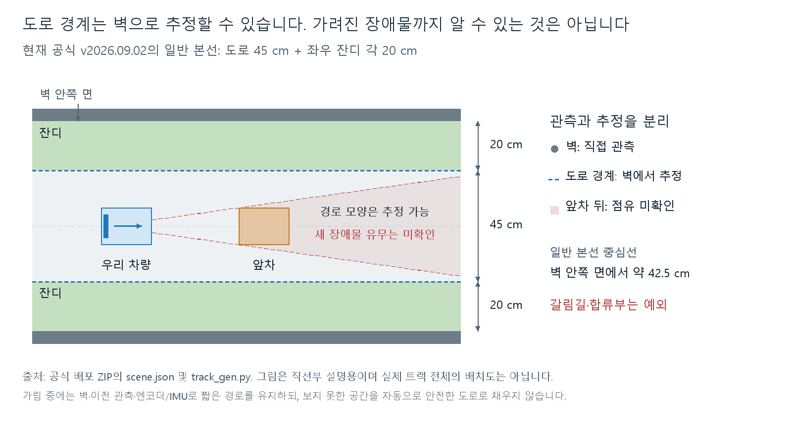
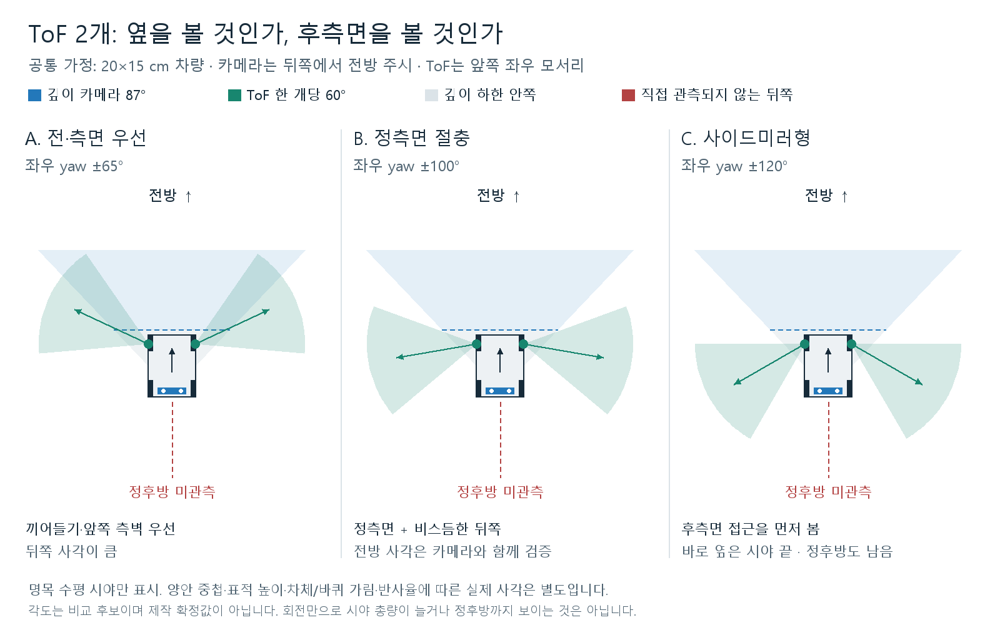
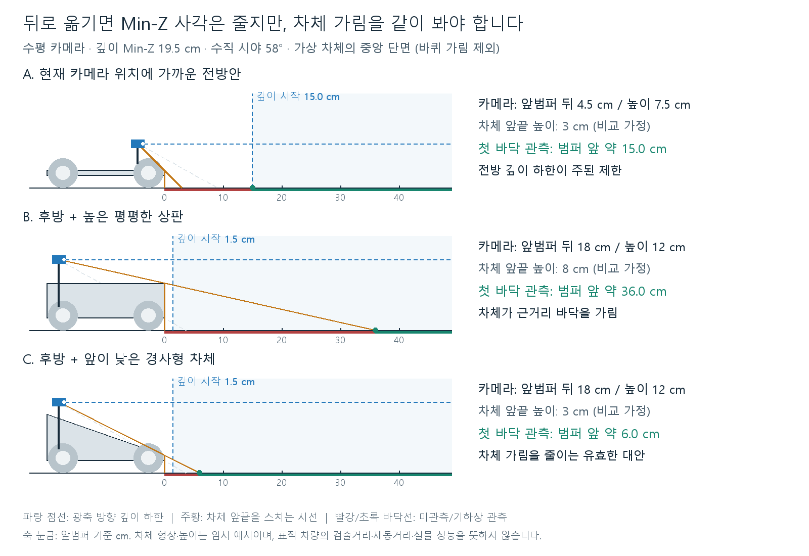

# 벽 기반 도로 추정과 카메라·ToF 장착 기하

검토일: 2026-09-03. 팀 논의용 설계 검토이며 새 주행 알고리즘·센서 배치의
구현이나 실차 검증 결과가 아닙니다. D435i와 기존 C1·ToF 여섯 개의
시뮬레이션 기준선은 변경하지 않았습니다.

후속 업데이트: 위 문장은 9월 3일 기하 검토 당시의 상태입니다. 이후 사용자는
카메라는 전방에 유지하고 측면 ToF 네 개와 C1+ToF 여섯 개를 비교하자고 요청했습니다.
현재 구현은 [결정 0015](../decisions/0015-selectable-lidar-stereo-autonomy-prototypes.md)를
따릅니다. 아래 중후방 카메라·다른 방향각 그림은 보존된 후보이며 현재 장착값이 아닙니다.

## 이번 검토의 결론

- 일반 본선에서는 **깊이로 벽을 찾고, 알려진 벽–도로 간격으로 도로 경계를
  추정하는 방법**이 유효합니다. RGB 도로 분할이 반드시 주 방법일 필요는 없습니다.
- 앞차가 가린 **경로 모양의 추정**과, 그 뒤에 **새 장애물이 없다는 확인**은
  서로 다릅니다. 전자는 벽·이전 관측·지도와 자기 운동 추정으로 보완할 수
  있지만, 후자는 직접 관측 없이 보장하지 않습니다.
- ToF는 차량 중심에서 방사형으로만 설치할 필요가 없습니다. 앞쪽 좌우 외곽에
  놓고 정측면 또는 후측면을 보게 하는 사이드미러형도 비교 가치가 있습니다.
- 카메라를 뒤로 옮기면 앞범퍼 기준 깊이 하한이 가까워집니다. 다만 높이·차체
  단면·양쪽 렌즈의 가림까지 함께 설계해야 이 이득을 사용할 수 있습니다.
- 비교 우선안은 **전방을 보는 중후방 카메라 + 앞쪽 좌우 ToF의 정측면 절충안**입니다.
  카메라 후퇴 18 cm·광학 중심 높이 12 cm, ToF yaw ±100°는 설명과 비교를
  위한 출발점이며 제작 확정값이 아닙니다. 기존 ±65°안도 대조군으로 남깁니다.

## 1. 벽으로 도로와 잔디를 나눌 수 있는가



현재 보존한 공식 `v2026.09.02`를 다시 읽었습니다. `output_final/scene.json`은
본선 폭 0.45 m·양측 잔디 각 0.20 m·벽 두께 0.05 m·높이 0.30 m를 기록합니다.
`track_gen.py`의 `build_corridor_polygon`은 본선 중심선에 `도로 반폭+0.20 m`를
더한 통로를 만들고, `build_union_wall_boxes`는 그 바깥에 벽 두께를 배치합니다.

따라서 **분기·합류와 겹치지 않는 일반 본선의 설계값**은 다음과 같습니다.

- 벽 안쪽 면 → 도로 가장자리: 약 20 cm
- 벽 안쪽 면 → 도로 중심선: 약 42.5 cm
- 벽 안쪽 면 사이: 약 85 cm. 이 중 실제 도로는 가운데 45 cm입니다.

거리 센서의 비스듬한 광선 길이에서 무조건 20 cm를 빼는 방식은 아닙니다.
깊이 점군을 차량 좌표계로 옮겨 벽의 선·곡선과 법선 방향을 추정한 뒤, 도로 쪽으로
오프셋해야 합니다. 차량 폭·조향 중 돌출·추정 오차만큼 경로 영역을 추가로 줄입니다.

다만 **코스 전체에 20 cm를 고정 적용할 수는 없습니다.** 같은 생성기의
`build_corridor_polygon`에서 지름길은 `width_m/2`로 합쳐지며 본선과 같은
20 cm 잔디 띠를 추가하지 않습니다. 합류부는 통로의 합집합 경계이고, 매우 작은
내부 섬에는 벽이 생략될 수도 있습니다. `scene.json`의 간략한 잔디 설명보다
실제 생성기·형상을 우선해야 합니다.

권장 역할은 `벽 기반 도로 추정`을 기본으로 하고, RGB 경계·ArUco·사전 코스
형상·이전 관측을 예외 처리와 교차 확인에 사용하는 것입니다. 이는 전 코스에서
RGB를 반드시 주 도로 분할기로 써야 한다는 뜻도, RGB가 필요 없다는 뜻도 아닙니다.

출처: [공식 릴리스](https://github.com/MOSW626/istech-it-arena/releases/tag/v2026.09.02),
[보존 ZIP과 파일 해시](../../assets/track/official/v2026.09.02/SOURCE.md).
ZIP 내부 `track_gen.py` 1397–1437행·1514–1523행을 확인했으며 원본은 변경하지 않았습니다.

## 2. 가림은 경로와 장애물 점유를 나누어 처리

앞차가 바닥을 가려도 그 위나 옆의 벽이 보이면 도로 경계를 계속 추정할 수
있습니다. 양쪽 벽까지 가려지면 이전에 본 벽/경로를 엔코더·IMU의 자기 운동으로
현재 좌표계에 옮겨 짧게 유지합니다. 이를 위해 처음부터 완전한 SLAM이 필요한
것은 아니지만, 짧은 구간의 이동·회전 추정은 필요합니다.

인식 결과에는 다음 구분을 유지합니다.

1. **직접 관측한 빈 공간:** 이번 깊이 관측에서 물체 전면까지 확인한 영역.
2. **경로로 추정한 영역:** 벽·지도·이전 관측에 따라 길일 가능성이 높은 곳.
3. **점유 미확인 영역:** 앞차 뒤처럼 이번에 물체 유무를 확인하지 못한 곳.

2번이라는 이유로 3번을 1번으로 바꾸면 안 됩니다. 가림 시간이 길어지거나,
갈림길에서 경로 신뢰도가 낮아지면 감속·앞차 추종·정지를 선택합니다. 높게 달아
앞차 위를 보는 것도 보완책이지만 다른 차량 높이에 제한이 없어 보장할 수 없습니다.

## 3. 벽·움직이는 차·멈춘 차는 어떻게 구분하고 대응하는가

깊이 한 장의 `가까운 점`만으로는 벽과 차량을 확실히 구별할 수 없습니다.
권장 흐름은 다음과 같습니다.

```text
깊이 유효성 검사 → 지면 평면 추정 → 지면 위 점군
                       ├─ 길게 이어지는 벽 후보 + 이전 벽/지도와 일치 여부
                       └─ 경로 안 물체 덩어리 + 프레임 간 위치/속도 추적
엔코더·IMU ──────────────── 자기 차량 이동/회전 보상
                       ↓
정적 경계 / 이동 물체 / 정지 물체 / 불명확한 물체
                       ↓
차량이 지나갈 영역과 충돌 여부 → 감속·추종·정지·경로 유지
```

벽도 우리가 이동하면 영상과 차량 좌표계에서는 움직입니다. 물체 속도는 반드시
자기 운동을 보상한 뒤 추정합니다. 카메라를 뒤로 옮기면 회전 때 센서가 움직이는
양도 달라지므로 장착 위치를 외부 보정값에 반영합니다.

| 관측/판단 | 대응 원칙 |
|---|---|
| 코너를 이루는 정적 벽 | 벽을 주행 경계로 사용하고 곡률에 맞춰 감속·조향. 화면 정면에 벽이 있다는 이유만으로 무조건 정지는 아님 |
| 주행 경로를 막는 벽·정지 차량 | 통과 가능한 경로가 확실하지 않으면 제동·정지 |
| 움직이는 앞차 | 상대 접근속도와 차간 거리를 추적해 감속·추종. 앞차의 급정지 가능성도 반영 |
| 벽인지 차량인지 불명확 | 우선 장애물 점유로 보수적으로 처리. 분류가 끝날 때까지 제동을 늦추지 않음 |

예를 들어 우리가 2 m/s로 달릴 때 2 m 앞 정적 물체까지의 단순 TTC는 1초지만,
앞차가 같은 방향으로 1.5 m/s로 달리면 상대속도 기준 TTC는 4초입니다. 이 값은
정속·일직선 예시이며 실제 제동 여유는 감속도·지연·앞차 급정지·경로 겹침까지
반영해야 합니다. 멈춘 차량도 세계 좌표에서 정지하므로 `정적=벽`으로 분류하면 안 됩니다.

후방 식별 마커가 검출되면 차량 판정·추적의 추가 근거로 사용할 수 있지만,
가림·방향·마커 미검출을 이유로 차량이 없다고 판정하지 않습니다. 범용 자동차
검출기가 처음 보는 소형 경기 차량을 모두 찾을 것이라고도 가정하지 않습니다.

지면/벽 평면 추정의 구현 출발점은 [PCL 평면 분할](https://pointclouds.org/documentation/tutorials/planar_segmentation.html)
같은 강건 기하 모델입니다. 이 라이브러리 예제가 실제 코스의 차량·벽 분리를
검증한 것은 아니며, 좁은 표본·굽은 벽에는 지역 선/곡선과 시간 일관성이 필요합니다.

## 4. ToF는 방사형만 가능한가: 사이드미러형 비교



기존 여섯 개는 방사형 링이지만 두 개 축소안은 그 형식을 따를 필요가 없습니다.
여기서 사이드미러형은 **광학 거울을 추가한다는 뜻이 아니라**, 차체 앞쪽 좌우
외곽에 센서를 놓고 옆·뒤로 돌려 장착하는 방식입니다.

- **±65°:** 앞쪽 끼어들기와 전측면 보강에 유리한 기존 후보입니다.
- **±100°:** 정측면이 시야 가운데에 가깝고 뒤쪽도 일부 봅니다. 카메라를 뒤로
  옮겨 앞쪽 주변이 실제로 잘 보인다면 함께 비교할 만한 절충안입니다.
- **±120°:** 후측면 접근을 우선합니다. 수평 60°에서 정측면 90°는 시야 끝이며,
  차체 바로 옆 검출을 가장자리 성능에 맡길 위험이 있습니다. 정후방 180°도
  자동으로 포함되는 것은 아닙니다.

카메라를 뒤로 옮기면 같은 앞쪽 물체를 더 작은 방위각으로 볼 수 있어 ToF를
뒤로 돌릴 여유가 생길 수 있습니다. 그러나 실제 센서 원점이 서로 다르고,
Min-Z·양안 중첩·높이까지 영향을 주므로 방향각 합만으로 빈틈을 평가하면 안 됩니다.
원거리 명목 각도만 보더라도 `87°+60°×2=207°`에 불과합니다.

두 개로는 모든 방향의 접근을 동시에 보장하지 못하므로, 보지 못하는 구역이
필요한 급격한 진로 변경·추월 복귀는 지원 범위에서 제외하는 보수적 출발점을
유지합니다. 다만 이전 문서의 `4개/5개 최소안`은 **특정 각도·역할에 대한
비교 후보**이지, 그 수량이면 경주가 안전하다거나 그 미만이면 어떤 방식의
주행도 불가능하다는 보편적인 기준은 아닙니다.

세 번째 센서를 추가할 수 있더라도 무조건 후방으로 정하지 않습니다. 실제
검사에서 전방 깊이 하한 안쪽의 위험이 가장 크면 전방 근거리 보강, 후측면 접근이
더 크면 그쪽 보강을 선택합니다. 두 개 구성으로 남는 사각은 속도·차간 거리·허용
행동을 제한하는 조건이지, 도식의 부채꼴을 넓게 그려 없앨 수 있는 부분이 아닙니다.

제작 시에는 다음을 지킵니다.

- 광학 중심은 우선 지면 4~5 cm를 비교하되, 앞바퀴의 최대 조향·차체와 실제
  상대 차량 높이를 함께 검사합니다. 낮은 상대 차량과 높은 상판을 동시에
  보려면 영역별 높이를 사용해야 합니다.
- 센서 창은 차체 외곽에서 바퀴·브래킷을 피하되, **사이드미러처럼 15 cm 폭
  밖으로 돌출하는 설계를 자동 허용하지 않습니다.** 모듈·배선·고정부까지 포함해
  확정 외형 안에 배치할 수 있는지 확인합니다.
- VL53L7CX의 검출 시야는 수평/수직 60°지만 수광부의 가림 금지 영역은
  약 74°입니다. 창/하우징을 검출각 60°에 딱 맞게 좁혀 만들지 않습니다.
  [ST 데이터시트 §1](https://www.st.com/resource/en/datasheet/vl53l7cx.pdf)
- 시야 내 점유·상대 접근을 추적하는 역할과 독립 제동 보조를 구분합니다.
  ToF가 단순 정지 스위치만이라는 뜻은 아닙니다. 실제 추적 성능은 영역별
  유효 상태·지연·가림·반사율·간섭 시험으로 판단합니다.

## 5. 카메라 후방 장착은 근거리 사각을 줄이는가



**깊이 Min-Z 문제에 대해서는 유효합니다.** 수평 카메라에서 앞범퍼보다 `a`만큼
뒤에 렌즈를 놓으면, 광축 방향 깊이 하한이 앞범퍼 기준으로 대략 `Min-Z-a`가 됩니다.

현재 설정은 모델 중심에서 카메라 X=+5.5 cm, 앞끝 X=+10 cm이므로 렌즈가
앞범퍼보다 4.5 cm 뒤에 있습니다. D435i 848×480의 Min-Z=19.5 cm를 쓰면
단순 깊이 하한은 범퍼 앞 약 15 cm입니다. 카메라를 X=-8 cm, 즉 범퍼 뒤
18 cm에 두면 약 1.5 cm가 됩니다. **같은 광축 높이·가림 제외의 계산**입니다.
이를 실제 차량을 1.5 cm까지 안정적으로 검출한다는 뜻으로 해석하지 않습니다.

공식 D400 데이터시트 표 4-11에서 D435i의 848×480 Min-Z 195 mm와
1280×720의 280 mm를 다시 확인했습니다. 해상도별 하한은 다르며, 가까울수록
양쪽 스테레오 영상이 겹치지 않는 영역도 커집니다. 또한 깊이가 없어져도 RGB
영상까지 사라지는 것은 아닙니다. RGB로 물체를 볼 수 있더라도 정확한 거리는
다른 근거로 추정해야 합니다. [D400 데이터시트 §4.4–4.6](https://dev.realsenseai.com/download/42003/)

이미 추적하던 앞차가 Min-Z 안으로 들어와 깊이가 사라졌다면 `차량이 사라져
빈 공간이 됨`으로 처리하지 않습니다. 짧은 시간의 추적 예측과 불확실성을 유지하고,
RGB/근거리 보완 센서로 확인하거나 감속·정지합니다. 관측 없이 오래 계속 추종하지 않습니다.

그림은 깊이 하한과 **바닥의 첫 관측 위치**를 구분합니다. 가상의 중앙 단면에서
카메라를 범퍼 뒤 18 cm·높이 12 cm에 놓으면 다음과 같습니다.

- 앞끝 높이 8 cm인 평평한 상판: 차체 때문에 바닥이 약 36 cm까지 가려집니다.
- 앞끝 높이 3 cm인 경사형 차체: 같은 계산에서 바닥 가림이 약 6 cm로 줄어듭니다.

이것이 사용자가 제안한 삼각형/쐐기형 형상이 도움이 되는 이유입니다. 차체 전체를
반드시 삼각형으로 만들 필요는 없고, **두 스테레오 렌즈 앞의 시야 통로를 낮고
비어 있게** 만드는 것이 핵심입니다. 한쪽 렌즈만 가리지 않으면 되는 것도 아닙니다.
카메라의 IR projector·RGB 렌즈·배선·다른 센서 브래킷도 확인합니다.

높이만 올리는 것은 별개입니다. 같은 수평 방향에서 카메라가 높아질수록 아래
시야 끝이 바닥과 만나는 지점은 멀어집니다. Min-Z도 광축 방향 깊이 하한이므로
센서를 위로 올려 직선거리를 늘렸다는 이유만으로 해결되지 않습니다. 아래로
조금 기울이면 근거리 바닥은 개선할 수 있지만 먼 코스·신호등·ArUco 시야와
차체 가림을 다시 계산해야 합니다. 높이 증가에 따른 브래킷 진동·무게중심·전복
민감도 역시 별도입니다.

이 비교의 13.5 cm 깊이 하한 이득은 20 km/h 이동 시간으로 약 24 ms입니다.
근접 추적의 유지는 개선할 수 있어도 고속 제동에 필요한 관측 거리·지연을
대체하지는 못합니다. 카메라 후방 장착을 안전 속도 증가의 근거로 쓰지 않습니다.

### 카메라를 바꿀 때

- D436 공식 페이지의 Min-Z는 20 cm, 깊이 시야는 87°×58°입니다. 실제 선택
  프로필과 하한·노출·유효 중첩을 확인하기 전 D435i 계산을 그대로 보증하지 않습니다.
  [D436 공식 사양](https://www.realsenseai.com/products/d436/)
- OAK-D Lite의 스테레오 수평 시야는 제조사 센서 표상 약 73°로 더 좁습니다.
  근거리 설정은 해상도·Extended Disparity 등에 따라 달라집니다. 조회한 제품
  페이지에는 480P 센서와 맞지 않는 일반 800P 예시 및 baseline 단위 오기도
  섞여 있어, 일반 OAK-D 표를 Lite의 확정 스트림 표로 옮기지 않았습니다.
  실제 캘리브레이션·모드별 깊이 유효 영역을 측정한 뒤 배치를 다시 계산합니다.
  [OAK-D Lite 센서 표](https://docs.luxonis.com/hardware/products/OAK-D%20Lite),
  [Luxonis 근거리 깊이 설정](https://docs.luxonis.com/hardware/platform/depth/configuring-stereo-depth/)

## 6. 다음 비교 시험

1. 현재 카메라 위치와 중후방 위치를 같은 표적·프로필로 비교합니다. 3·5·10 cm
   높이 표적을 범퍼 앞/옆에서 움직여 RGB 표시와 깊이 유효율을 따로 측정합니다.
2. ToF 앞쪽 외곽 배치에서 ±65°/±100°/±120°를 비교합니다. 최대 좌·우 조향과
   실제 브래킷을 포함해 나란한 차량·후측면 접근·cut-in의 최초 검출 및 공백을
   차량 좌표계의 지도에 기록합니다.
3. 벽이 보이는 앞차 가림 → 한쪽 벽만 보임 → 양쪽 벽이 모두 가림 → 정지 차량
   순으로 경로 유지와 감속·추종·정지를 확인합니다. 벽/차량 분류가 틀려도
   독립 점유 기반 제동이 늦어지지 않는지 검사합니다.
4. 통과한 배치만 속도를 올려 검증합니다. 기존 고속 LiDAR 시험은 이 구조의
   검증으로 승계하지 않습니다. 이번에는 도면·수식 검증만 수행했습니다.

## 공유용 그림과 재현

- [ToF 두 개 방향 비교 PNG](figures/2026-09-03-placement/tof-two-orientations.png) /
  [SVG](figures/2026-09-03-placement/tof-two-orientations.svg)
- [카메라 위치·차체 가림 PNG](figures/2026-09-03-placement/camera-position-and-hood.png) /
  [SVG](figures/2026-09-03-placement/camera-position-and-hood.svg)
- [벽·도로·앞차 가림 PNG](figures/2026-09-03-placement/wall-road-and-occlusion.png) /
  [SVG](figures/2026-09-03-placement/wall-road-and-occlusion.svg)
- [기하 계산값](figures/2026-09-03-placement/geometry-checks.json)

`python scripts/render_sensor_placement_diagrams.py`로 다시 생성할 수 있습니다.
Pillow와 한글 TTF가 필요하며 Windows 기본 맑은 고딕을 사용합니다. 다른
환경에서는 `--font <TTF 경로>`를 지정합니다. 생성 시 텍스트 캔버스 이탈과
핵심 거리 계산을 검사합니다. 그림의 2D 명목 시야·가상 단면 검증과 센서/주행
검증을 혼동하지 않습니다.
