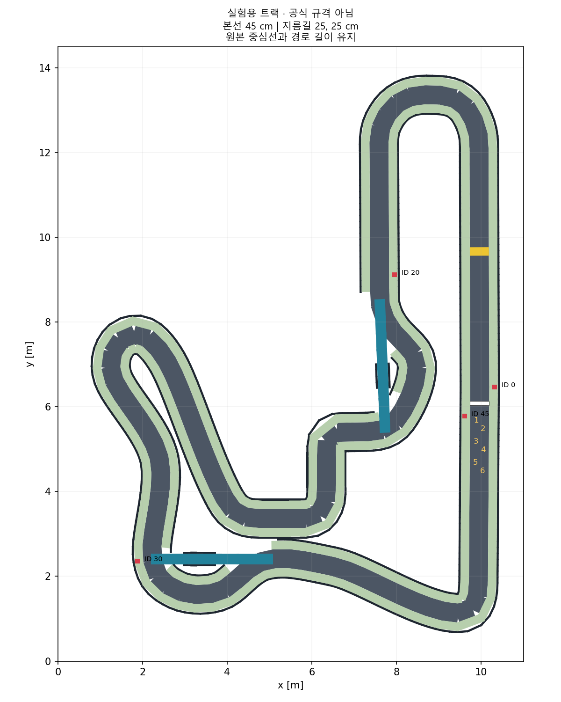

# 실험 트랙과 차량 치수 안내

갱신: 2026-09-01. 이 문서의 실험값은 공식 경기 규격이 아닙니다.

## 현재 기본값과 이 문서의 범위

현재 기본은 공식 `v2026.09.01` 기반 `track:=official`입니다. 이 문서는 초기 전달본과 기존 45/25 cm 폭 실험의 설정·검증 이력을 계속 보존합니다. 아래 25 cm 지름길·큰 독립형 마커·20 cm 방지턱을 새 공식 실행본의 값으로 읽지 않습니다.

| 지도 | 본선 / 지름길 | 현재 상태 |
|---|---|---|
| `official` | 45 cm / 각각 20 cm | 기본. 공식 도로·벽·중심선과 문서화한 시설 보정 |
| `experimental` | 45 cm / 각각 25 cm | 이전 사용자 승인 실험, 선택 실행·재생성 유지 |
| `original` | 35 cm / 각각 12 cm | 초기 전달본 재현, 선택 실행·원본 보존 유지 |

공식 기준 커밋은 `921f3f9a044f1a38ff849cb8e19d00182dd5533b`입니다. 보존 ZIP·해시는 [`assets/track/official/v2026.09.01/SOURCE.md`](../../assets/track/official/v2026.09.01/SOURCE.md), 입력은 [`config/tracks/official_v2026.09.01.yaml`](../../config/tracks/official_v2026.09.01.yaml), 생성기는 [`scripts/build_official_track.py`](../../scripts/build_official_track.py), 결과는 `src/arena_gazebo/worlds/it_arena_official/`입니다.

공식 실행본은 인쇄판 10 cm·코드 7 cm·하단 5 cm의 새 공식 벽 부착 pose와 PNG/PBR 판을 그대로 사용합니다. 방지턱의 공식 명목 길이 5 cm·높이 1 cm와 임시 곡면, 신호등·출발/피니시 표시를 구분합니다. 벽의 공식 마찰 0.8은 보존하되 도로·잔디·방지턱 계수는 미지정 상태를 유지합니다. 자세한 근거는 [공식 재감사](OFFICIAL_V2026_09_01_REAUDIT.md), [마커·시설 안내](OFFICIAL_MARKERS_AND_FACILITIES.md), [ADR 0011](../decisions/0011-official-v2026-09-01-track.md)에 있습니다.

## 계속 확인할 원문

- 현재 공식 기준은 [공식 `track/README.md`](https://github.com/MOSW626/istech-it-arena/blob/921f3f9a044f1a38ff849cb8e19d00182dd5533b/track/README.md)와 같은 버전 출력물·도면·인쇄 시트입니다. 아래 과거 원문·접근 실패·실험 결과와 구분합니다.
- [2026-06-30 미팅](https://maddening-cause-ce7.notion.site/2026-06-30-38f99fd42e3080f6956fe5a5b90d0824): A-1 도로 폭, A-2 차량 크기·지름길·마커 배치 의도.
- [트랙 감사 기록](TRACK_AUDIT.md): 회의록과 현재 제공된 파일의 수치 차이.
- [본선 45 cm·차량 3대 상단 배치 확인](MAIN_WIDTH_VISUAL_CHECK.md): 현재 실험 월드와 실제 차량 SDF의 폭 적용을 사진으로 대조한 자료.
- [트랙 분리 결정](../decisions/0003-track-variants.md): 원본 보존 및 실험값 채택 근거.
- [시설 안내](FACILITIES.md)와 [결정 0005](../decisions/0005-experimental-facilities.md): 신호등·방지턱·표지판·노면 표시와 차량 영상 검사.

회의록은 2026-08-30에 공개 본문을 확인한 6월 당시 자료입니다. 최신 규정으로 단정하지 않습니다. 트랙 폭·차량 외형·분기 표지판을 변경할 때 원문과 이후 주최 측 공지를 재확인합니다.

2026-08-31 시설 작업의 재조회는 본문 접근 실패로 끝났습니다. 아래 시설 치수는 새 공식 사양이 아니라 사용자가 요청한 실험 가정입니다. 같은 날 후속 공식 GitHub 확인과 `official` 적용이 이루어졌으며, 이 과거 접근 실패 기록을 삭제하거나 현재 공식 확인 상태로 덮어쓰지 않습니다.

## 원본과 실험본의 구분

| 항목 | 원본 재현용 `original` | 실험용 `experimental` |
|---|---|---|
| 본선 노면 폭 | 35 cm | 45 cm: 6월 회의록 기준 |
| 지름길 폭 | 각각 12 cm | 각각 25 cm: 임시 실험값 |
| 중심선·경로 길이 | 제공된 값 | 좌표·누적 거리 그대로, 한 바퀴 46.6329 m |
| 출발 위치 | 제공된 6개 | 동일한 6개, 26×16.6 cm U자 표시와 번호 추가 |
| ID 30 표지판 | 기존 왼쪽 | 지름길 입구 간섭을 피해 반대편. `s`·ID 유지, 독립형 표지판 |
| 신호등 | 진행 방향 가로대·등 중심 약 108 cm·세 등 발광 | 횡단 가로대·등 중심 30 cm·초기 빨강. 데모에서 동적 전환 |
| 방지턱 | 직육면체, 길이·폭 축 뒤바뀜 | 진행 길이 20 cm·노면 폭 45 cm·높이 1 cm 곡선 |
| 피니시 | 별도 체크무늬 표시 없음 | 기존 위치에 45×10 cm 체크무늬 |
| 기본 실행 여부 | 선택 실행 | 당시 기본, 현재 선택 실행 |

본선의 잔디 폭 20 cm씩, 벽 높이 30 cm·두께 5 cm와 방지턱 높이 1 cm는 유지합니다. 마커는 검은 코드 바깥 변 10 cm·흰 여백 포함 판 13 cm로 크기 기준을 명시했습니다. 원본 PNG 전체를 10 cm 면에 놓는 방식과 실제 코드 크기가 다르므로 물리적 인쇄 크기까지 보존했다고 표현하지 않습니다. 잔디를 실제 대회의 연석으로 확정한 것은 아니며, 물리적 벽 사이 폭은 위 노면 폭과 다릅니다.

보존 위치는 다음과 같습니다.

- 받은 ZIP: `assets/track/original/it_arena_track_final.zip` — 수정하지 않음.
- 압축 해제본: `assets/track/source/it_arena_track/` — 수정하지 않음.
- 원본 재현용 실행 파일: `src/arena_gazebo/worlds/it_arena_track/`.
- 실험용 실행 파일: `src/arena_gazebo/worlds/it_arena_experimental/`.
- 실험 설정: `config/tracks/experimental.yaml`.

생성기는 원본 디렉터리에 캐시 파일을 만들지 않으며, 임시 출력은 `build/track_generation/` 아래에서 처리합니다. 생성 작업이 보존 디렉터리나 원본 실행 월드에 실험 결과를 덮어쓰지 않도록 경로 검사를 둡니다.

## 현재 기본 실행과 기존 지도 선택

WSL의 프로젝트 디렉터리에서 실행합니다.

```bash
source /opt/ros/jazzy/setup.bash
colcon build --symlink-install
source install/setup.bash
ros2 launch arena_bringup simulation.launch.py
```

위 명령의 현재 기본값은 공식 지도입니다. 이 문서의 이전 실험이나 초기 원본을 재현하려면 실행 중인 시뮬레이터를 `Ctrl+C`로 종료한 다음 하나를 선택합니다.

```bash
ros2 launch arena_bringup simulation.launch.py track:=experimental
ros2 launch arena_bringup simulation.launch.py track:=original
```

지도 선택은 차량 크기를 바꾸지 않습니다. 원본 지름길 12 cm는 15 cm 폭 차량으로 통과할 수 없습니다. 창 없이 실행하려면 `headless:=true`, 출발 위치를 바꾸려면 `grid_slot:=0`부터 `grid_slot:=5`까지 지정합니다.

## 기존 실험본의 폭을 다시 바꾸는 방법

아래 절차는 `experimental`에만 적용합니다. 공식 실행본의 도로·벽·중심선은 고정 버전 ZIP에서 유지하며, 실험 폭 설정을 바꾸어 공식값으로 승격하지 않습니다. 공식 실행본을 재생성하려면 `python3 scripts/build_official_track.py`, 원본·입력·출력 해시 대조는 `python3 scripts/build_official_track.py --check`를 사용합니다. 해시 대조는 실제 주행 검증이 아닙니다.

`config/tracks/experimental.yaml`의 `main_width_m`와 `branch_widths_m`를 변경한 뒤 재생성합니다. 분기 폭 배열 순서는 갈림길1·갈림길2입니다. `marker_side_overrides`의 ID 30 보정은 현 입구 간섭을 해결하기 위한 항목입니다.

```bash
python3 scripts/build_experimental_track.py
python3 scripts/build_experimental_track.py --check
colcon build --symlink-install
source install/setup.bash
ros2 launch arena_bringup simulation.launch.py track:=experimental
```

SDF뿐 아니라 지도 이미지·지도 설정·CSV·장면 메타데이터를 함께 생성합니다. `design.json`은 생성된 설계 사본이며 직접 편집하는 기준 파일이 아닙니다. 원본 생성기의 전체 배율 옵션을 사용하거나 보존된 JSON의 숫자만 고치는 방식으로 수정하지 않습니다.

시설 설정은 같은 YAML의 `facilities`에서 관리합니다. `scripts/experimental_facilities.py`가 실험 출력의 시설만 교체합니다. 코드의 검은 면 크기·표지판 높이·방지턱 형상·가로대 높이와 가시성 검사 재현은 [시설 안내](FACILITIES.md)에 있습니다.

## 축거·윤거를 길고 넓게 잡는 이유와 한계

현재 임시값은 축거 14.5 cm·윤거 13.5 cm·바퀴 지름 5 cm·폭 1.2 cm입니다. 이전 13 cm·10.5 cm는 더 작은 임시 모델에서 유지하던 보수적인 값이었습니다.

- 축거는 앞뒤 바퀴 중심 사이 거리입니다. 직진 상태의 바퀴 끝까지 길이는 `축거 + 바퀴 지름`이므로, 지름 5 cm 바퀴와 전체 길이 20 cm에서는 축거의 이상적인 상한이 15 cm입니다. 현재 14.5 cm는 앞뒤에 각각 2.5 mm 여유를 둡니다.
- 윤거는 좌우 바퀴 중심 사이 거리입니다. 직진 상태의 바퀴 바깥 폭은 `윤거 + 바퀴 폭`이므로, 폭 1.2 cm 바퀴와 전체 폭 15 cm에서는 이상적인 상한이 13.8 cm입니다. 현재 13.5 cm는 좌우 각각 1.5 mm 여유를 둡니다.
- 위 상한은 현재의 단순 바퀴 형상과 중심 조향축을 가정한 기하 계산입니다. 너클·허브·서보 링크·베어링·범퍼·공차를 반영한 제작 가능성의 보증은 아닙니다.
- 현재 조향 관절 한계 ±0.45 rad에서 보수적인 바퀴 점유 폭은 약 16.76 cm까지 늘어납니다. 이것을 검차 위반으로 판정하지 않으며, 충돌 여유 계산에 사용합니다. 공식 검차 때의 조향 조건은 미확정입니다.
- 축거가 길수록 같은 조향각에서 회전 반경이 커집니다. 단순 자전거 모델의 `R = 축거 / tan(조향각)`은 약 26.9 cm에서 30.0 cm로 증가합니다. 실제 Ackermann 바퀴 각도·미끄러짐·서보 한계까지 포함한 최소 회전 반경은 별도 확인해야 합니다.

전체 외형 20×15 cm 외의 수치는 하드웨어 설계 확정 전 임시값입니다. `vehicle.yaml`로 바꿀 수 있으며, 모델은 제작용 CAD가 아니라 단순 충돌체를 쓰는 주행 실험용 근사입니다.

## 기존 원본·실험본의 검증 방법과 보장하지 않는 것

```bash
python3 scripts/validate_track.py
python3 scripts/build_experimental_track.py --check
python3 -m pytest tests src/arena_vehicle_interface/test -q
python3 scripts/smoke_simulation.py --track experimental
python3 scripts/smoke_simulation.py --track original
```

- 원본 ZIP 해시 및 압축 해제 파일 23개의 바이트 일치를 확인합니다.
- 중심선 CSV의 `x/y/s`는 원본과 같고 폭 열만 바뀌는지 검사합니다. 지도·출발 위치·마커 정보는 선택한 월드의 `scene.json`에서 읽습니다.
- 실제 SDF의 벽·저층 시설 충돌체와 출발 위치·본선·지름길 표본에서의 차량 외형을 대조합니다. 회귀 검사에서는 조향 점유 폭의 보수적인 직사각형도 확인합니다.
- 짧은 실행 검사는 별도 ROS/Gazebo 통신 영역에서 전진·회전·엔코더·RGB·깊이·IMU·명령 중단 정지를 확인하고, 자신이 시작한 프로세스만 종료합니다. 로그는 Git에서 제외한 `artifacts/tests/`에 저장합니다.
- 후속 시설 검사에서 정지 속도 흔들림을 발견했고 Gazebo의 jerk 제한을 제외한 뒤 같은 지속 정지 조건을 통과했습니다. 과거 실패와 수정 후 재검사는 [시설 안내](FACILITIES.md)에서 구분합니다.
- 본선 긴 직선부에 현재 20×15 cm 차량 SDF 세 대를 횡방향 15 cm 간격으로 배치해, 실제 45 cm 노면에 겹침 없이 정확히 들어가는 상단 사진을 남겼습니다. 명목 여유는 0 cm이며 병렬 주행 가능성을 증명하지 않습니다. 배치 좌표와 원본 사진은 [별도 확인 기록](MAIN_WIDTH_VISUAL_CHECK.md)에 있습니다.
- **정적 간섭 검사나 짧은 주행 성공이 지름길 진입·합류의 연속 조향 궤적, 단독 완주, 다중 차량 안전성을 증명하지는 않습니다.** 기존 급커브 반경 검사 실패도 유지됩니다.


