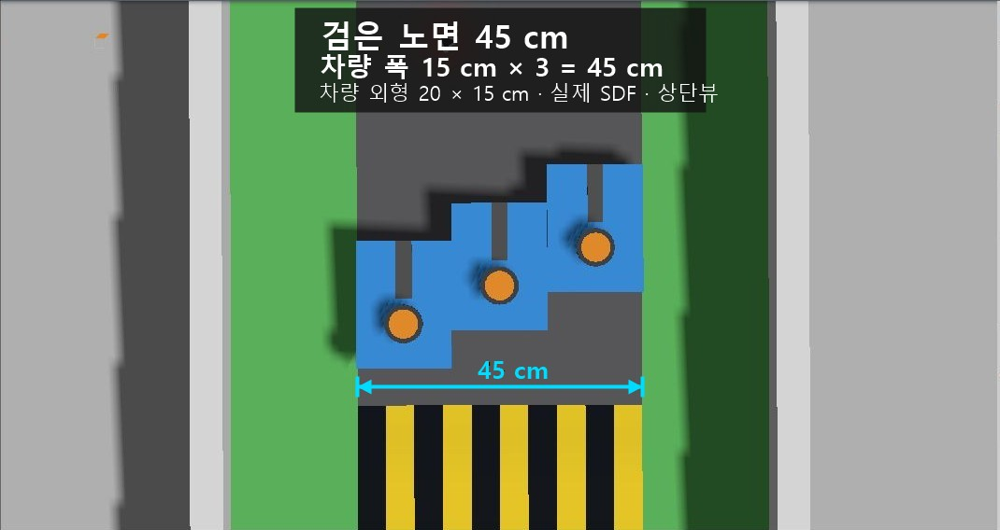

# 실험 본선 45 cm·차량 3대 상단 배치 확인

갱신: 2026-08-31. 이 자료는 현재 실험 지도 구현을 확인한 시각 자료이며, 최신 공식 경기 규격을 확정하는 근거는 아닙니다.

## 확인 목적

본선 노면 폭 45 cm가 문서에만 적히고 실제 Gazebo 월드에는 적용되지 않았거나, 차량 모델이 목표 외형 20×15 cm보다 크게 생성됐을 가능성을 확인했습니다. 문서 수치로 다시 문서 수치를 증명하는 묘한 순환은 피하고, 현재 설치된 실험 월드에 실제 차량 SDF 세 대를 생성해 상단에서 촬영했습니다.

## 사용한 실제 형상

- 실험 월드: `src/arena_gazebo/worlds/it_arena_experimental/world.sdf`
- 장면 메타데이터: 같은 디렉터리의 `scene.json`
- 차량 설정: `src/arena_description/config/vehicle.yaml`
- 차량 모델: `src/arena_description/models/arena_car/model.sdf.xacro`
- 본선 검은 노면의 시각·충돌 형상 폭: 0.45 m
- 차량 차체의 시각·충돌 형상: 길이 0.20 m·폭 0.15 m
- 직진 바퀴 바깥 치수: 길이 0.195 m·폭 0.147 m

촬영용 축소 차량이나 단순한 대체 상자를 사용하지 않았습니다. D435i와 임시 C1 형상까지 포함된 현재 차량 SDF를 그대로 세 번 생성했습니다.

## 배치

본선 오른쪽 긴 직선부에서 진행 방향을 맞추고, 세 차량 중심을 횡방향으로 정확히 0.15 m씩 벌렸습니다. 서로 구분할 수 있도록 진행 방향 위치만 0.06 m씩 어긋나게 했습니다.

| 차량 | 중심 X (m) | 중심 Y (m) | Yaw (rad) |
|---|---:|---:|---:|
| 왼쪽 | 9.8052 | 9.9261 | 1.5738 |
| 가운데 | 9.9552 | 9.9861 | 1.5738 |
| 오른쪽 | 10.1052 | 10.0461 | 1.5738 |

차량 폭 합계는 `0.15 m × 3 = 0.45 m`입니다. 따라서 세 차체는 서로 겹치지 않고 노면 양쪽 경계에 정확히 닿지만, 명목 횡방향 여유는 0 m입니다.

## 촬영 결과

[표기가 없는 원본 이미지](images/main_width_three_cars_raw.jpg)도 함께 보존합니다.

카메라는 노면 위 10 m에서 수직에 가깝게 배치하고 수평 화각을 9°로 좁혔습니다. 높이 6 cm인 차체 윗면이 노면보다 크게 보이는 원근 비율은 약 `10 / (10 - 0.06) = 1.006`으로, 가까운 카메라에서 생기던 약 4%의 과장을 줄였습니다. 그림의 45 cm 화살표는 실제 노면 양쪽 경계에 맞춘 설명 표기입니다.

## 해석 범위

이 결과로 확인되는 사항은 다음과 같습니다.

- 현재 실험 월드에는 본선 검은 노면 폭 45 cm가 실제로 적용돼 있습니다.
- 현재 차량의 시각·충돌 차체는 목표값 20×15 cm이며, 직진 바퀴도 그 안에 있습니다.
- 폭 15 cm 차량 세 대는 정지 상태의 이상적인 기하에서 45 cm 노면에 정확히 들어갑니다.

다음 사항은 이 사진으로 증명되지 않습니다.

- 세 차량의 실제 병렬 주행 가능성
- 차체 제작 공차·위치 오차·조향 중 바퀴 돌출·접촉 허용 여부
- 벽과 초록 영역을 포함한 사용 가능 공간 또는 추월 규정
- 45 cm가 대회 최신 공식 규격이라는 사실

여유가 정확히 0 cm이므로 실제 세 대 병렬 주행은 불가능한 조건에 가깝습니다. 이 사진은 구현 치수가 잘못 적용되지 않았음을 보여 주는 자료이며, 안전한 다중 차량 주행 가능성을 보여 주는 자료로 사용하면 안 됩니다.
